三、ODS层数仓构建

（1）保持数据原貌不做任何修改，作用：备份数据。

（2）数据采用压缩，减少磁盘存储空间（例如：原始数据100G，可压缩到10G左右）。

（3）创建分区表，防止后续的全表扫描。

（4）创建外部表。在企业开发中，除了自己用的临时表，创建内部表外，绝大多数场景都是创建外部表。

## 安装Hive2.3

### 安装Hive

注意：如果是cdh方式可以直接在cdh里安装配置hive，普通方式按照

1）下载apache-hive-2.3.6-bin.tar.gz 到/opt/software目录下

```
cd /opt/software
wget http://archive.apache.org/dist/hive/hive-2.3.6/apache-hive-2.3.6-bin.tar.gz
```

2）解压到/opt/module

```
tar -zxvf apache-hive-2.3.6-bin.tar.gz -C /opt/module/
```

3）修改apache-hive-2.3.6-bin名称为hive

```
mv apache-hive-2.3.6-bin hive
```

4）下载Mysql的mysql-connector-java-5.1.46-bin.jar拷贝到/opt/module/hive/lib/

```
cp /opt/soft/mysql/mysql-connector-java-5.1.46/mysql-connector-java-5.1.46-bin.jar /opt/module/hive/lib/
```

5）在/opt/module/hive/conf路径上，创建hive-site.xml文件

```
cd /opt/module/hive/conf

vim hive-site.xml
```

添加如下内容

```xml
<?xml version="1.0"?>
<?xml-stylesheet type="text/xsl" href="configuration.xsl"?>
<configuration>
    
    <!-- mysql的服务器地址改为自己的，createDatabaseIfNotExist 当JDBC连接指定数据库,如果此数据库不存在,此参数值为true时，则自动创建此数据库 -->
	<property>
	    <name>javax.jdo.option.ConnectionURL</name>
	    <value>jdbc:mysql://master:3306/metastore?createDatabaseIfNotExist=true</value>
	    <description>JDBC connect string for a JDBC metastore</description>
	</property>

	<property>
	    <name>javax.jdo.option.ConnectionDriverName</name>
	    <value>com.mysql.jdbc.Driver</value>
	    <description>Driver class name for a JDBC metastore</description>
	</property>

    <!-- mysql用户名 -->
	<property>
	    <name>javax.jdo.option.ConnectionUserName</name>
	    <value>root</value>
	    <description>username to use against metastore database</description>
	</property>

    <!-- mysql密码 -->
	<property>
	    <name>javax.jdo.option.ConnectionPassword</name>
	    <value>1234</value>
	    <description>password to use against metastore database</description>
	</property>
    
    <!-- hive hdfs上的地址 -->
    <property>
         <name>hive.metastore.warehouse.dir</name>
         <value>/user/hive/warehouse</value>
         <description>location of default database for the warehouse</description>
    </property>
    
    <property>
        <name>hive.cli.print.header</name>
        <value>true</value>
    </property>

    <property>
        <name>hive.cli.print.current.db</name>
        <value>true</value>
    </property>
    
    <property>
        <name>hive.metastore.schema.verification</name>
        <value>false</value>
    </property>
    
    <property>
        <name>datanucleus.schema.autoCreateAll</name>
        <value>true</value> 
    </property>
    
    <!-- hive安装在哪个服务器节点，thrift://master:9083中的主机名就更换为相应的主机名 -->
    <property>
        <name>hive.metastore.uris</name>
        <value>thrift://master:9083</value>
    </property>
</configuration>
```

cdh6.2可以通过http://master:10002/conf查看

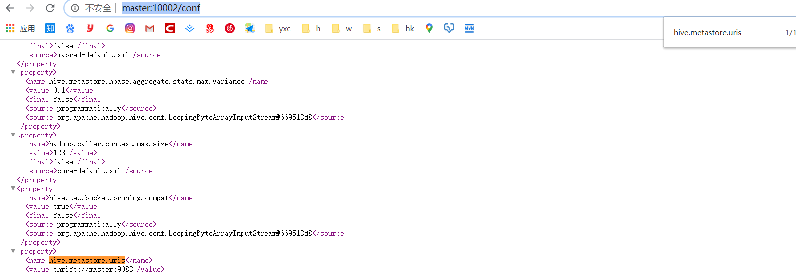

6）启动服务

进入hive安装目录

```
cd /opt/module/hive
nohup bin/hive --service metastore &

nohup bin/hive --service hiveserver2 & 
```

注意：hive2.x版本需要启动两个服务metastore和hiveserver2，否则会报错Exception in thread "main" java.lang.RuntimeException: org.apache.hadoop.hive.ql.metadata.HiveException: java.lang.RuntimeException: Unable to instantiate org.apache.hadoop.hive.ql.metadata.SessionHiveMetaStoreClient。

cdh方式：通过控制台启动

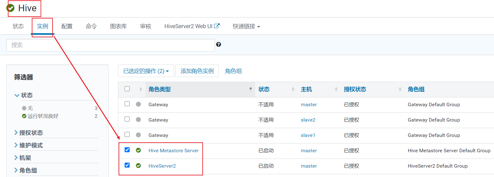

4）服务启动完毕后在启动Hive

```
cd /opt/module/hive

bin/hive
```

### 安装Tez

hive引擎的选择：tez和spark。mr引擎在hive 2中将被弃用。官方推荐使用tez或spark等引擎。

tez：使用有向无环图。内存式计算。

spark：可以同时作为批式和流式的处理引擎，减少学习成本。

Tez是一个构建于YARN之上的支持复杂的DAG任务的数据处理框架。它由Hontonworks开源，它把mapreduce的过程拆分成若干个子过程，同时可以把多个mapreduce任务组合成一个较大的DAG任务，减少了mapreduce之间的文件存储，同时合理组合其子过程从而大幅提升MapReduce作业的性能。

1）下载tez的依赖包：http://tez.apache.org

```
wget https://downloads.apache.org/tez/0.9.1/apache-tez-0.9.1-bin.tar.gz
```

2）拷贝apache-tez-0.9.1-bin.tar.gz到服务器的/opt/software目录

3）将apache-tez-0.9.1-bin.tar.gz上传到HDFS的/tez目录下。

```
hadoop fs -mkdir /tez

hadoop fs -put /opt/software/apache-tez-0.9.1-bin.tar.gz/ /tez
```

4）解压缩apache-tez-0.9.1-bin.tar.gz

```
 tar -zxvf apache-tez-0.9.1-bin.tar.gz -C /opt/module
```

5）修改名称

```
mv apache-tez-0.9.1-bin/ tez
```

### 集成Tez

1）进入到Hive的配置目录：/opt/module/hive/conf

2）在Hive的/opt/module/hive/conf下面创建一个tez-site.xml文件

```
vim tez-site.xml
```

添加如下内容

```xml
<?xml version="1.0" encoding="UTF-8"?>
<?xml-stylesheet type="text/xsl" href="configuration.xsl"?>
<configuration>
    <property>
        <name>tez.lib.uris</name>
        <value>${fs.defaultFS}/tez/apache-tez-0.9.1-bin.tar.gz</value>
    </property>
    <property>
         <name>tez.use.cluster.hadoop-libs</name>
         <value>true</value>
    </property>
    <property>
         <name>tez.history.logging.service.class</name>        
         <value>org.apache.tez.dag.history.logging.ats.ATSHistoryLoggingService</value>
    </property>
</configuration>
```

3）在hive-env.sh文件中添加tez环境变量配置和依赖包环境变量配置

```
mv hive-env.sh.template hive-env.sh

vim hive-env.sh
```

添加如下配置

```shell
# Set HADOOP_HOME to point to a specific hadoop install directory
export HADOOP_HOME=/opt/module/hadoop-2.7.2

# Hive Configuration Directory can be controlled by:
export HIVE_CONF_DIR=/opt/module/hive/conf

# Folder containing extra libraries required for hive compilation/execution can be controlled by:
export TEZ_HOME=/opt/module/tez-0.9.1    #是你的tez的解压目录
export TEZ_JARS=""
for jar in `ls $TEZ_HOME |grep jar`; do
    export TEZ_JARS=$TEZ_JARS:$TEZ_HOME/$jar
done
for jar in `ls $TEZ_HOME/lib`; do
    export TEZ_JARS=$TEZ_JARS:$TEZ_HOME/lib/$jar
done

export HIVE_AUX_JARS_PATH=/opt/module/hadoop-2.7.2/share/hadoop/common/hadoop-lzo-0.4.20.jar$TEZ_JARS
```

3）在hive-site.xml文件中添加如下配置，更改hive计算引擎

```xml
<property>

  <name>hive.execution.engine</name>

  <value>tez</value>

</property>
```

### cdh6集成Tez

1）安装编译环境依赖的OS包

> yum -y install gcc gcc-c++ libstdc++-devel make build

2）安装Protobuf2.5.0

下载解压安装

> wget https://github.com/protocolbuffers/protobuf/releases/download/v2.5.0/protobuf-2.5.0.tar.gz
>
> tar -zxvf protobuf-2.5.0.tar.gz 
>
> cd protobuf-2.5.0/
>  ./configure && make && make install

3）验证是否安装成功

> protoc --version
> libprotoc 2.5.0

4）安装maven

```
yum install -y maven
mvn -v
```

5）下载解压tez

```
wget https://downloads.apache.org/tez/0.9.1/apache-tez-0.9.1-src.tar.gz
tar -zxvf apache-tez-0.9.1-src.tar.gz -C /opt/module
cd /opt/module/
mv apache-tez-0.9.1-src/ tez
```

6）配置编译tez

找到自己的hadoop版本号

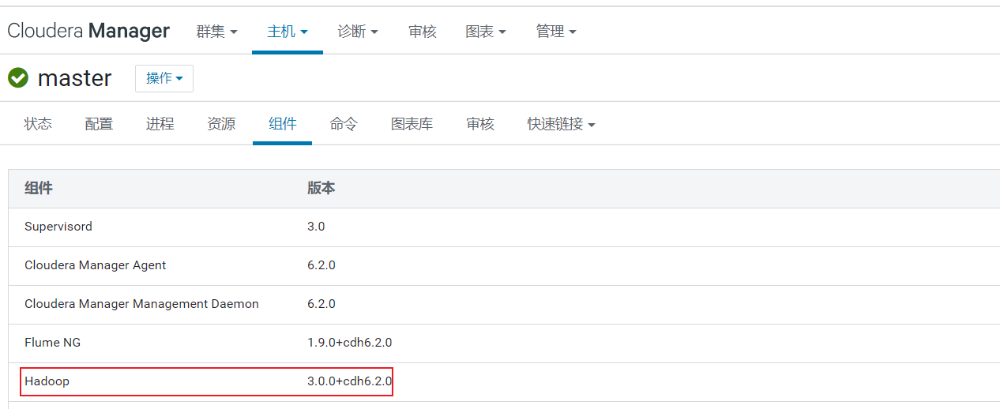

```
vim tez/pom.xml
```

修改下面五处

```
第一处:
<hadoop.version>3.0.0-cdh6.2.0</hadoop.version>
第二处:
<repository>
  <id>cloudera</id>
  <url>https://repository.cloudera.com/artifactory/cloudera-repos/</url>
  <name>Cloudera Repositories</name>
  <snapshots>
    <enabled>false</enabled>
  </snapshots>
</repository>
第三处:
<pluginRepository>
  <id>cloudera</id>
  <name>Cloudera Repositories</name>
  <url>https://repository.cloudera.com/artifactory/cloudera-repos/</url>
</pluginRepository>
第四处:
<dependency>
  <groupId>com.sun.jersey</groupId>
  <artifactId>jersey-client</artifactId>
  <version>1.19</version>
</dependency>
第五处:
<!--<module>tez-ext-service-tests</module>-->
<!--<module>tez-ui</module>-->
注:将这两个注释掉,如果有需要可以不用注释
```

7）mvn编译

```
mvn clean package -Dmaven.javadoc.skip=true -Dmaven.test.skip=true
```


### 测试

使用dbeaver连接hive数据仓库，执行下面SQL

```
create table student(id int,name string);
insert into student values(1,"zhangsan");
select * from student;-- 查询出1    zhangsan表示成功
show databases;
create database gmall;
use gmall;
```

### 注意事项

1）运行Tez时检查到用过多内存而被NodeManager杀死进程问题：

```
Caused by: org.apache.tez.dag.api.SessionNotRunning: TezSession has already shutdown. Application application_1546781144082_0005 failed 2 times due to AM Container for appattempt_1546781144082_0005_000002 exited with  exitCode: -103
For more detailed output, check application tracking page:http://master:8088/cluster/app/application_1546781144082_0005Then, click on links to logs of each attempt.
Diagnostics: Container [pid=11116,containerID=container_1546781144082_0005_02_000001] is running beyond virtual memory limits. Current usage: 216.3 MB of 1 GB physical memory used; 2.6 GB of 2.1 GB virtual memory used. Killing container.
```

这种问题是从机上运行的Container试图使用过多的内存，而被NodeManager kill掉了。

```
[摘录] The NodeManager is killing your container. It sounds like you are trying to use hadoop streaming which is running as a child process of the map-reduce task. The NodeManager monitors the entire process tree of the task and if it eats up more memory than the maximum set in mapreduce.map.memory.mb or mapreduce.reduce.memory.mb respectively, we would expect the Nodemanager to kill the task, otherwise your task is stealing memory belonging to other containers, which you don't want.
```

**2****）解决方法：**

（1）关掉虚拟内存检查，修改yarn-site.xml，

<property>

  <name>yarn.nodemanager.vmem-check-enabled</name>

  <value>false</value>

</property>

（2）修改后一定要分发，并重新启动hadoop集群。

[atguigu@hadoop102 hadoop]$ xsync yarn-site.xml

## 用户行为数据-介绍

用户在使用产品时，记录用户和产品交互行为的数据，称为用户行为数据。例如点赞，点击，浏览，收藏等。

分类：当前应用的数据分为启动日志和事件日志。
1.事件日志
描述： 用户使用APP时，记录各种交互行为的数据！
格式：时间戳(上传的时间戳)|｛"ap":"产品来源","cm":{设备的公共字段},"et":[{事件},{},{}]｝

2.启动日志的格式
启动日志： 用户打开应用，此时记录一些信息。启动日志对于分析日活，月活等数据非常有用的。
格式：{"en":"start",...}

### 埋点数据基本格式

l 公共字段：基本所有安卓手机都包含的字段。

l 业务字段：埋点上报的字段，有具体的业务类型。

下面就是一个示例，表示业务字段的上传。

```
{
"ap":"xxxxx",//项目数据来源 app pc
"cm": {  //公共字段
		"mid": "",  // (String) 设备唯一标识
        "uid": "",  // (String) 用户标识
        "vc": "1",  // (String) versionCode，程序版本号
        "vn": "1.0",  // (String) versionName，程序版本名
        "l": "zh",  // (String) language系统语言
        "sr": "",  // (String) 渠道号，应用从哪个渠道来的。
        "os": "7.1.1",  // (String) Android系统版本
        "ar": "CN",  // (String) area区域
        "md": "BBB100-1",  // (String) model手机型号
        "ba": "blackberry",  // (String) brand手机品牌
        "sv": "V2.2.1",  // (String) sdkVersion
        "g": "",  // (String) gmail
        "hw": "1620x1080",  // (String) heightXwidth，屏幕宽高
        "t": "1506047606608",  // (String) 客户端日志产生时的时间
        "nw": "WIFI",  // (String) 网络模式
        "ln": 0,  // (double) lng经度
        "la": 0  // (double) lat 纬度
    },
"et":  [  //事件
            {
                "ett": "1506047605364",  //客户端事件产生时间
                "en": "display",  //事件名称
                "kv": {  //事件结果，以key-value形式自行定义
                    "goodsid": "236",
                    "action": "1",
                    "extend1": "1",
"place": "2",
"category": "75"
                }
            }
        ]
}
```

示例日志（服务器时间戳 | 日志）：

```
1540934156385|{
    "ap": "gmall", 
    "cm": {
        "uid": "1234", 
        "vc": "2", 
        "vn": "1.0", 
        "la": "EN", 
        "sr": "", 
        "os": "7.1.1", 
        "ar": "CN", 
        "md": "BBB100-1", 
        "ba": "blackberry", 
        "sv": "V2.2.1", 
        "g": "abc@gmail.com", 
        "hw": "1620x1080", 
        "t": "1506047606608", 
        "nw": "WIFI", 
        "ln": 0
    }, 
        "et": [
            {
                "ett": "1506047605364",  //客户端事件产生时间
                "en": "display",  //事件名称
                "kv": {  //事件结果，以key-value形式自行定义
                    "goodsid": "236",
                    "action": "1",
                    "extend1": "1",
"place": "2",
"category": "75"
                }
            },{
		        "ett": "1552352626835",
		        "en": "active_background",
		        "kv": {
			         "active_source": "1"
		        }
	        }
        ]
    }
}
```

下面是各个埋点日志格式。其中商品点击属于信息流的范畴。

### 事件日志1-商品列表页(loading)

事件名称：loading

| 标签         | 含义                                                         |
| ------------ | ------------------------------------------------------------ |
| action       | 动作：开始加载=1，加载成功=2，加载失败=3                     |
| loading_time | 加载时长：计算下拉开始到接口返回数据的时间，（开始加载报0，加载成功或加载失败才上报时间） |
| loading_way  | 加载类型：1-读取缓存，2-从接口拉新数据   （加载成功才上报加载类型） |
| extend1      | 扩展字段 Extend1                                             |
| extend2      | 扩展字段 Extend2                                             |
| type         | 加载类型：自动加载=1，用户下拽加载=2，底部加载=3（底部条触发点击底部提示条/点击返回顶部加载） |
| type1        | 加载失败码：把加载失败状态码报回来（报空为加载成功，没有失败） |

### 事件日志2-商品点击(display)

事件标签：display

| 标签     | 含义                                                         |
| -------- | ------------------------------------------------------------ |
| action   | 动作：曝光商品（正常曝光的商品）=1，点击商品（购买流量的商品，如图中的第一个同仁堂右下角有广告二字的商品）=2， |
| goodsid  | 商品ID（服务端下发的ID）                                     |
| place    | 顺序（第几条商品，第一条为0，第二条为1，如此类推）           |
| extend1  | 曝光类型：1 - 首次曝光 2-重复曝光                            |
| category | 分类ID（服务端定义的分类ID）                                 |


### 事件日志3-商品详情页(newsdetail)

事件标签：newsdetail

| 标签          | 含义                                                         |
| ------------- | ------------------------------------------------------------ |
| entry         | 页面入口来源：应用首页=1、push=2、详情页相关推荐=3           |
| action        | 动作：开始加载=1，加载成功=2（pv），加载失败=3, 退出页面=4   |
| goodsid       | 商品ID（服务端下发的ID）                                     |
| show_style    | 商品样式：0、无图、1、一张大图、2、两张图、3、三张小图、4、一张小图、5、一张大图两张小图 |
| news_staytime | 页面停留时长：从商品开始加载时开始计算，到用户关闭页面所用的时间。若中途用跳转到其它页面了，则暂停计时，待回到详情页时恢复计时。或中途划出的时间超过10分钟，则本次计时作废，不上报本次数据。如未加载成功退出，则报空。 |
| loading_time  | 加载时长：计算页面开始加载到接口返回数据的时间 （开始加载报0，加载成功或加载失败才上报时间） |
| type1         | 加载失败码：把加载失败状态码报回来（报空为加载成功，没有失败） |
| category      | 分类ID（服务端定义的分类ID）                                 |

### 事件日志4-广告(ad)

事件名称：ad

| 标签       | 含义                                                         |
| ---------- | ------------------------------------------------------------ |
| entry      | 入口：商品列表页=1 应用首页=2 商品详情页=3                   |
| action     | 动作：请求广告=1 取缓存广告=2 广告位展示=3 广告展示=4 广告点击=5 |
| content    | 状态：成功=1 失败=2                                          |
| detail     | 失败码（没有则上报空）                                       |
| source     | 广告来源:admob=1 facebook=2 ADX（百度）=3 VK（俄罗斯）=4     |
| behavior   | 用户行为：   主动获取广告=1    被动获取广告=2                |
| newstype   | Type: 1-  图文 2-图集 3-段子 4-GIF 5-视频 6-调查 7-纯文 8-视频+图文 9-GIF+图文 0-其他 |
| show_style | 内容样式：无图(纯文字)=6 一张大图=1 三站小图+文=4 一张小图=2 一张大图两张小图+文=3 图集+文 = 5    一张大图+文=11  GIF大图+文=12 视频(大图)+文 = 13   来源于详情页相关推荐的商品，上报样式都为0（因为都是左文右图） |

### 事件日志5-消息通知(notification)

事件标签：notification

| 标签    | 含义                                                         |
| ------- | ------------------------------------------------------------ |
| action  | 动作：通知产生=1，通知弹出=2，通知点击=3，常驻通知展示（不重复上报，一天之内只报一次）=4 |
| type    | 通知id：预警通知=1，天气预报（早=2，晚=3），常驻=4           |
| ap_time | 客户端弹出时间                                               |
| content | 备用字段                                                     |

### 事件日志6-用户前台活跃(active_foreground)

事件标签: active_foreground

| 标签    | 含义                                         |
| ------- | -------------------------------------------- |
| push_id | 推送的消息的id，如果不是从推送消息打开，传空 |
| access  | 1.push  2.icon 3.其他                        |

### 事件日志7-用户后台活跃(active_background)

事件标签: active_background

| 标签          | 含义                                        |
| ------------- | ------------------------------------------- |
| active_source | 1=upgrade,2=download(下载),3=plugin_upgrade |

### 事件日志8-评论（comment）

描述：评论表

| **序号** | **字段名称** | **字段描述**                              | **字段类型** | **长度** | **允许空** | **缺省值** |
| -------- | ------------ | ----------------------------------------- | ------------ | -------- | ---------- | ---------- |
| 1        | comment_id   | 评论表                                    | int          | 10,0     |            |            |
| 2        | userid       | 用户id                                    | int          | 10,0     | √          | 0          |
| 3        | p_comment_id | 父级评论id(为0则是一级评论,不为0则是回复) | int          | 10,0     | √          |            |
| 4        | content      | 评论内容                                  | string       | 1000     | √          |            |
| 5        | addtime      | 创建时间                                  | string       |          | √          |            |
| 6        | other_id     | 评论的相关id                              | int          | 10,0     | √          |            |
| 7        | praise_count | 点赞数量                                  | int          | 10,0     | √          | 0          |
| 8        | reply_count  | 回复数量                                  | int          | 10,0     | √          | 0          |

 

### 事件日志9-收藏（favorites）

描述：收藏

| **序号** | **字段名称** | **字段描述** | **字段类型** | **长度** | **允许空** | **缺省值** |
| -------- | ------------ | ------------ | ------------ | -------- | ---------- | ---------- |
| 1        | id           | 主键         | int          | 10,0     |            |            |
| 2        | course_id    | 商品id       | int          | 10,0     | √          | 0          |
| 3        | userid       | 用户ID       | int          | 10,0     | √          | 0          |
| 4        | add_time     | 创建时间     | string       |          | √          |            |

### 事件日志10-点赞（praise）

描述：所有的点赞表

| **序号** | **字段名称** | **字段描述**                                            | **字段类型** | **长度** | **允许空** | **缺省值** |
| -------- | ------------ | ------------------------------------------------------- | ------------ | -------- | ---------- | ---------- |
| 1        | id           | 主键id                                                  | int          | 10,0     |            |            |
| 2        | userid       | 用户id                                                  | int          | 10,0     | √          |            |
| 3        | target_id    | 点赞的对象id                                            | int          | 10,0     | √          |            |
| 4        | type         | 点赞类型 1问答点赞 2问答评论点赞 3 文章点赞数4 评论点赞 | int          | 10,0     | √          |            |
| 5        | add_time     | 添加时间                                                | string       |          | √          |            |

 

### 事件日志11-错误日志

| errorBrief  | 错误摘要 |
| ----------- | -------- |
| errorDetail | 错误详情 |

### 启动日志数据

事件标签: start

| 标签         | 含义                                                         |
| ------------ | ------------------------------------------------------------ |
| entry        | 入口： push=1，widget=2，icon=3，notification=4, lockscreen_widget =5 |
| open_ad_type | 开屏广告类型: 开屏原生广告=1, 开屏插屏广告=2                 |
| action       | 状态：成功=1 失败=2                                          |
| loading_time | 加载时长：计算下拉开始到接口返回数据的时间，（开始加载报0，加载成功或加载失败才上报时间） |
| detail       | 失败码（没有则上报空）                                       |
| extend1      | 失败的message（没有则上报空）                                |
| en           | 日志类型start                                                |

```
{
    "action":"1",
    "ar":"MX",
    "ba":"HTC",
    "detail":"",
    "en":"start",
    "entry":"2",
    "extend1":"",
    "g":"43R2SEQX@gmail.com",
    "hw":"640*960",
    "l":"en",
    "la":"20.4",
    "ln":"-99.3",
    "loading_time":"2",
    "md":"HTC-2",
    "mid":"995",
    "nw":"4G",
    "open_ad_type":"2",
    "os":"8.1.2",
    "sr":"B",
    "sv":"V2.0.6",
    "t":"1561472502444",
    "uid":"995",
    "vc":"10",
    "vn":"1.3.4"
}
```

## 用户行为数据-脚本/配置文件

用户行为数据用到的所有脚本都在这里。*.conf文件放在flume安装目录下myagents文件夹内，注意在flume安装目录下建立myagents文件夹。

### f1.conf

```shell
#a1是agent的名称，a1中定义了一个叫r1的source，如果有多个，使用空格间隔
a1.sources = r1
a1.channels = c1 c2

#组名名.属性名=属性值
a1.sources.r1.type=TAILDIR
a1.sources.r1.filegroups=f1
a1.sources.r1.batchSize=1000
#读取/tmp/logs/app-yyyy-mm-dd.log ^代表以xxx开头$代表以什么结尾 .代表匹配任意字符
#+代表匹配任意位置
a1.sources.r1.filegroups.f1=/tmp/logs/^app.+.log$
#JSON文件的保存位置，注意这里要根据自己的flume安装地址做相应修改。
a1.sources.r1.positionFile=/usr/lib/flume-ng/test/log_position.json

#定义拦截器
a1.sources.r1.interceptors = i1
#注意这里的路径要根据自己的MyInterceptor路径做相应修改。
a1.sources.r1.interceptors.i1.type = com.sire.flume.interceptor.MyInterceptor$Builder

#定义ChannelSelector
a1.sources.r1.selector.type = multiplexing
a1.sources.r1.selector.header = topic
a1.sources.r1.selector.mapping.topic_start = c1
a1.sources.r1.selector.mapping.topic_event = c2


#定义chanel
a1.channels.c1.type=org.apache.flume.channel.kafka.KafkaChannel
a1.channels.c1.kafka.bootstrap.servers=master:9092,slave1:9092,slave2:9092
a1.channels.c1.kafka.topic=topic_start
a1.channels.c1.parseAsFlumeEvent=false

a1.channels.c2.type=org.apache.flume.channel.kafka.KafkaChannel
a1.channels.c2.kafka.bootstrap.servers=master:9092,slave1:9092,slave2:9092
a1.channels.c2.kafka.topic=topic_event
a1.channels.c2.parseAsFlumeEvent=false

#连接组件 同一个source可以对接多个channel，一个sink只能从一个channel拿数据！
a1.sources.r1.channels=c1 c2
```

### f2.conf

注意：hdfs必须先建立origin_data文件夹

```
hdfs dfs -mkdir /origin_data
[root@master ~]# hdfs dfs -mkdir -p /origin_data/gmall/log/topic_start
[root@master ~]# hdfs dfs -mkdir -p /origin_data/gmall/log/topic_event

```


```shell
#配置文件编写
a1.sources = r1 r2
a1.sinks = k1 k2
a1.channels = c1 c2

#配置source
a1.sources.r1.type=org.apache.flume.source.kafka.KafkaSource
a1.sources.r1.kafka.bootstrap.servers=master:9092,slave1:9092,slave2:9092
a1.sources.r1.kafka.topics=topic_start
# 配置source从最开始的位置消费，不配置的话默认从最新的消费
a1.sources.r1.kafka.consumer.auto.offset.reset=earliest
a1.sources.r1.kafka.consumer.group.id=CG_Start

a1.sources.r2.type=org.apache.flume.source.kafka.KafkaSource
a1.sources.r2.kafka.bootstrap.servers=master:9092,slave1:9092,slave2:9092
a1.sources.r2.kafka.topics=topic_event
# 配置source从最开始的位置消费，不配置的话默认从最新的消费
a1.sources.r2.kafka.consumer.auto.offset.reset=earliest
a1.sources.r2.kafka.consumer.group.id=CG_Event
#配置channel
a1.channels.c1.type=file
a1.channels.c1.checkpointDir=/usr/lib/flume-ng/c1/checkpoint
#启动备用checkpoint
a1.channels.c1.useDualCheckpoints=true
a1.channels.c1.backupCheckpointDir=/usr/lib/flume-ng/c1/backupcheckpoint
#event存储的目录
a1.channels.c1.dataDirs=/usr/lib/flume-ng/c1/datas


a1.channels.c2.type=file
a1.channels.c2.checkpointDir=/usr/lib/flume-ng/c2/checkpoint
a1.channels.c2.useDualCheckpoints=true
a1.channels.c2.backupCheckpointDir=/usr/lib/flume-ng/c2/backupcheckpoint
a1.channels.c2.dataDirs=/usr/lib/flume-ng/c2/datas


#sink
a1.sinks.k1.type = hdfs
#一旦路径中含有基于时间的转义序列，要求event的header中必须有timestamp=时间戳，如果没有需要将useLocalTimeStamp = true
a1.sinks.k1.hdfs.path = hdfs://master:9000/origin_data/gmall/log/topic_start/%Y-%m-%d
a1.sinks.k1.hdfs.filePrefix = logstart-

a1.sinks.k1.hdfs.batchSize = 1000

#文件的滚动
#60秒滚动生成一个新的文件
a1.sinks.k1.hdfs.rollInterval = 30
#设置每个文件到128M时滚动
a1.sinks.k1.hdfs.rollSize = 134217700
#禁用基于event数量的文件滚动策略
a1.sinks.k1.hdfs.rollCount = 0
#指定文件使用LZO压缩格式
a1.sinks.k1.hdfs.fileType = CompressedStream 
a1.sinks.k1.hdfs.codeC = lzop
#a1.sinks.k1.hdfs.round = true
#a1.sinks.k1.hdfs.roundValue = 10
#a1.sinks.k1.hdfs.roundUnit = second


a1.sinks.k2.type = hdfs
a1.sinks.k2.hdfs.path = hdfs://master:9000/origin_data/gmall/log/topic_event/%Y-%m-%d
a1.sinks.k2.hdfs.filePrefix = logevent-
a1.sinks.k2.hdfs.batchSize = 1000
a1.sinks.k2.hdfs.rollInterval = 30
a1.sinks.k2.hdfs.rollSize = 134217700
a1.sinks.k2.hdfs.rollCount = 0
a1.sinks.k2.hdfs.fileType = CompressedStream 
a1.sinks.k2.hdfs.codeC = lzop
#a1.sinks.k2.hdfs.round = true
#a1.sinks.k2.hdfs.roundValue = 10
#a1.sinks.k2.hdfs.roundUnit = second

#连接组件
a1.sources.r1.channels=c1
a1.sources.r2.channels=c2
a1.sinks.k1.channel=c1
a1.sinks.k2.channel=c2
```

### dt

修改时间脚本

```shell
#/bin/bash
#在服务器上同步日期为指定的日期
if(($#==0))
then
	echo 请输入要修改的时间!
	exit;
fi

#修改系统时间
for i in master slave1 slave2
do
	echo ------------同步$i时间--------------
	ssh $i "sudo date -s '$@'"
done
```

修改时间命令格式：

```shell
dt 2020-06-25
```

### ct

同步时间脚本

```shell
#!/bin/bash
#将集群的时间都同步为最新的时间
for i in master slave1 slave2
do
	echo ------------同步$i时间--------------
	ssh $i sudo ntpdate -u ntp1.aliyun.com
done
```

### lg

日志生成脚本，必须在家目录/bin下建立lg脚本

```shell
vim /root/bin/lg
#!/bin/bash
#在slave1,slave2产生日志
for i in slave1 slave2
do
    ssh $i java -cp /opt/module/log-collector-0.0.1-SNAPSHOT-jar-with-dependencies.jar com.sire.appclient.AppMain $1 $2 > /dev/null 2>&1 &   
done
```

脚本增加权限

```shell
chmod +x /root/bin/lg
```


## 用户行为数据-maven工程

1）创建一个普通maven，名字为log-collector（日志收集）

2）创建一个包名：com.sire.appclient

3）在pom.xml文件中添加如下内容

```xml
<!--版本号统一-->
    <properties>
        <slf4j.version>1.7.20</slf4j.version>
        <logback.version>1.0.7</logback.version>
    </properties>

    <!-- ①解析JSON的框架FastJson
         ②日志记录框架： logback
                   log4j,log4j2,logback
                   logback是log4j的升级版，速度更快，性能更高，测试更充分！logback提供了
                   区别：  log4j使用的log4j.properties作为配置文件
                       logback使用logback.xml作为配置文件
                   使用： 在配置文件中，可以定义三种组件
                       Logger:  日志的记录器，可以在Logger上定义日志的记录级别(INFO,WARN)
                       Appender： 负责将输出的信息，追加到目的地(文件，控制台，网络端口，数据库)
                       Layout:  输出的样式，每条信息都会格式化为指定的样式输出
         ③打包框架
     -->
    <dependencies>
        <!--阿里巴巴开源json解析框架-->
        <dependency>
            <groupId>com.alibaba</groupId>
            <artifactId>fastjson</artifactId>
            <version>1.2.51</version>
        </dependency>

        <!--日志生成框架-->
        <dependency>
            <groupId>ch.qos.logback</groupId>
            <artifactId>logback-core</artifactId>
            <version>${logback.version}</version>
        </dependency>
        <dependency>
            <groupId>ch.qos.logback</groupId>
            <artifactId>logback-classic</artifactId>
            <version>${logback.version}</version>
        </dependency>
        <dependency>
            <groupId>junit</groupId>
            <artifactId>junit</artifactId>
            <version>4.12</version>
            <scope>test</scope>
        </dependency>
        <dependency>
            <groupId>org.projectlombok</groupId>
            <artifactId>lombok</artifactId>
            <version>1.18.12</version>
<!--            <scope>provided</scope>-->
        </dependency>
    </dependencies>

    <!--编译打包插件-->
    <build>
        <plugins>
            <!-- 如果已经在Maven的全局配置中，配置了JDK编译的界别，这个插件可以省略 -->
            <plugin>
                <groupId>org.apache.maven.plugins</groupId>
                <artifactId>maven-compiler-plugin</artifactId>
                <version>2.3.2</version>
                <configuration>
                    <source>1.8</source>
                    <target>1.8</target>
                </configuration>
            </plugin>

            <!-- 在mvn:package阶段使用
                    maven-assembly-plugin可以将当前项目依赖的Jar中的字节码也打包！
                    默认的打包插件maven-jar-plugin，只会将自己写的代码打包，默认仓库中已经安装了所需的依赖！
            -->
            <plugin>
                <artifactId>maven-assembly-plugin</artifactId>
                <configuration>
                    <descriptorRefs>
                        <descriptorRef>jar-with-dependencies</descriptorRef>
                    </descriptorRefs>
                    <archive>
                        <manifest>
                            <mainClass>com.sire.appclient.AppMain</mainClass>
                        </manifest>
                    </archive>
                </configuration>
                <executions>
                    <execution>
                        <id>make-assembly</id>
                        <phase>package</phase>
                        <goals>
                            <goal>single</goal>
                        </goals>
                    </execution>
                </executions>
            </plugin>
        </plugins>
    </build>
```

**注意**：com.sire.appclient.AppMain要和自己建的全类名一致。

### maven-公共字段Bean

bean类介绍，13个bean分别对应11个事件日志、1启动日志和AppBase公共日志

1）创建包名：com.sire.bean

2）在com.sire.bean包下依次创建如下bean对象

```java
/**
 * 公共日志
 */
@Data
public class AppBase{
    private String mid; // (String) 设备唯一标识
    private String uid; // (String) 用户uid
    private String vc;  // (String) versionCode，程序版本号
    private String vn;  // (String) versionName，程序版本名
    private String l;   // (String) 系统语言
    private String sr;  // (String) 渠道号，应用从哪个渠道来的。
    private String os;  // (String) Android系统版本
    private String ar;  // (String) 区域
    private String md;  // (String) 手机型号
    private String ba;  // (String) 手机品牌
    private String sv;  // (String) sdkVersion
    private String g;   // (String) gmail
    private String hw;  // (String) heightXwidth，屏幕宽高
    private String t;   // (String) 客户端日志产生时的时间
    private String nw;  // (String) 网络模式
    private String ln;  // (double) lng经度
    private String la;  // (double) lat 纬度
}
```

### maven-启动日志Bean

```java
/**
 * 启动日志
 */
@Data
public class AppStart extends AppBase {
    private String entry;//入口： push=1，widget=2，icon=3，notification=4, lockscreen_widget =5
    private String open_ad_type;//开屏广告类型:  开屏原生广告=1, 开屏插屏广告=2
    private String action;//状态：成功=1  失败=2
    private String loading_time;//加载时长：计算下拉开始到接口返回数据的时间，（开始加载报0，加载成功或加载失败才上报时间）
    private String detail;//失败码（没有则上报空）
    private String extend1;//失败的message（没有则上报空）
    private String en;//启动日志类型标记
}
```

### maven-错误日志Bean

```java
/**
 * 错误日志
 */
@Data
public class AppErrorLog {
    private String errorBrief;    //错误摘要
    private String errorDetail;   //错误详情
}
```

### maven-事件日志Bean之商品点击

```java
/**
 * 商品点击日志
 */
@Data
public class AppDisplay {
    private String action;//动作：曝光商品=1，点击商品=2，
    private String goodsid;//商品ID（服务端下发的ID）
    private String place;//顺序（第几条商品，第一条为0，第二条为1，如此类推）
    private String extend1;//曝光类型：1 - 首次曝光 2-重复曝光（没有使用）
    private String category;//分类ID（服务端定义的分类ID）
}
```

### maven-事件日志Bean之商品详情页

```java
/**
 * 商品详情
 */
@Data
public class AppNewsDetail {
    private String entry;//页面入口来源：应用首页=1、push=2、详情页相关推荐=3
    private String action;//动作：开始加载=1，加载成功=2（pv），加载失败=3, 退出页面=4
    private String goodsid;//商品ID（服务端下发的ID）
    private String showtype;//商品样式：0、无图1、一张大图2、两张图3、三张小图4、一张小图5、一张大图两张小图    来源于详情页相关推荐的商品，上报样式都为0（因为都是左文右图）
    private String news_staytime;//页面停留时长：从商品开始加载时开始计算，到用户关闭页面所用的时间。若中途用跳转到其它页面了，则暂停计时，待回到详情页时恢复计时。或中途划出的时间超过10分钟，则本次计时作废，不上报本次数据。如未加载成功退出，则报空。
    private String loading_time;//加载时长：计算页面开始加载到接口返回数据的时间 （开始加载报0，加载成功或加载失败才上报时间）
    private String type1;//加载失败码：把加载失败状态码报回来（报空为加载成功，没有失败）
    private String category;//分类ID（服务端定义的分类ID）
}
```

### maven-事件日志Bean之商品列表页

```java
/**
 * 商品列表
 */
@Data
public class AppLoading {
    private String action;//动作：开始加载=1，加载成功=2，加载失败=3
    private String loading_time;//加载时长：计算下拉开始到接口返回数据的时间，（开始加载报0，加载成功或加载失败才上报时间）
    private String loading_way;//加载类型：1-读取缓存，2-从接口拉新数据   （加载成功才上报加载类型）
    private String extend1;//扩展字段 Extend1
    private String extend2;//扩展字段 Extend2
    private String type;//加载类型：自动加载=1，用户下拽加载=2，底部加载=3（底部条触发点击底部提示条/点击返回顶部加载）
    private String type1;//加载失败码：把加载失败状态码报回来（报空为加载成功，没有失败）
}
```

### maven-事件日志Bean之广告

```java
/**
 * 广告
 */
@Data
public class AppAd {
    private String entry;//入口：商品列表页=1  应用首页=2 商品详情页=3
    private String action;//动作：请求广告=1 取缓存广告=2  广告位展示=3 广告展示=4 广告点击=5
    private String content;//状态：成功=1  失败=2
    private String detail;//失败码（没有则上报空）
    private String source;//广告来源:admob=1 facebook=2  ADX（百度）=3 VK（俄罗斯）=4
    private String behavior;//用户行为：    主动获取广告=1    被动获取广告=2
    private String newstype;//Type: 1- 图文 2-图集 3-段子 4-GIF 5-视频 6-调查 7-纯文 8-视频+图文  9-GIF+图文  0-其他
    private String show_style;//内容样式：无图(纯文字)=6 一张大图=1  三站小图+文=4 一张小图=2 一张大图两张小图+文=3 图集+文 = 5
    //一张大图+文=11   GIF大图+文=12  视频(大图)+文 = 13
    //来源于详情页相关推荐的商品，上报样式都为0（因为都是左文右图）
}
```

### maven-事件日志Bean之消息通知

```java
/**
 * 消息通知日志
 */
@Data
public class AppNotification {
    private String action;//动作：通知产生=1，通知弹出=2，通知点击=3，常驻通知展示（不重复上报，一天之内只报一次）=4
    private String type;//通知id：预警通知=1，天气预报（早=2，晚=3），常驻=4
    private String ap_time;//客户端弹出时间
    private String content;//备用字段
}
```

### maven-事件日志Bean之用户前台活跃

```java
/**
 * 用户前台活跃
 */
@Data
public class AppActive_foreground {
    private String push_id;//推送的消息的id，如果不是从推送消息打开，传空
    private String access;//1.push 2.icon 3.其他
}
```

### maven-事件日志Bean之用户后台活跃

```java
/**
 * 用户后台活跃
 */
@Data
public class AppActive_background {
    private String active_source;//1=upgrade,2=download(下载),3=plugin_upgrade
}
```

### maven-事件日志Bean之用户评论

```java
/**
 * 评论
 */
@Data
public class AppComment {
    private int comment_id;//评论表
    private int userid;//用户id
    private  int p_comment_id;//父级评论id(为0则是一级评论,不为0则是回复)
    private String content;//评论内容
    private String addtime;//创建时间
    private int other_id;//评论的相关id
    private int praise_count;//点赞数量
    private int reply_count;//回复数量
}
```

### maven-事件日志Bean之用户收藏

```java
/**
 * 收藏
 */
@Data
public class AppFavorites {
    private int id;//主键
    private int course_id;//商品id
    private int userid;//用户ID
    private String add_time;//创建时间
}
```

### maven-事件日志Bean之用户点赞

```java
/**
 * 点赞
 */
@Data
public class AppPraise {
    private int id; //主键id
    private int userid;//用户id
    private int target_id;//点赞的对象id
    private int type;//点赞类型 1问答点赞 2问答评论点赞 3 文章点赞数4 评论点赞
    private String add_time;//添加时间
}
```

### maven-主函数

AppMain类是为了造数据使用的，在com.sire.appclient包下建立AppMain类并添加如下内容：

```java
package com.sire.appclient;

import com.alibaba.fastjson.JSON;
import com.alibaba.fastjson.JSONArray;
import com.alibaba.fastjson.JSONObject;
import com.sire.bean.*;
import org.slf4j.Logger;
import org.slf4j.LoggerFactory;

import java.io.UnsupportedEncodingException;
import java.util.Random;

/**
 * 日志行为数据模拟
 */
public class AppMain {

    private final static Logger logger = LoggerFactory.getLogger(AppMain.class);
    private static Random rand = new Random();

    // 设备id
    private static int s_mid = 0;

    // 用户id
    private static int s_uid = 0;

    // 商品id
    private static int s_goodsid = 0;

    public static void main(String[] args) {

        // 参数一：控制发送每条的延时时间，默认是0
        Long delay = args.length > 0 ? Long.parseLong(args[0]) : 0L;

        // 参数二：循环遍历次数
        int loop_len = args.length > 1 ? Integer.parseInt(args[1]) : 1000;

        // 生成数据
        generateLog(delay, loop_len);
    }

    private static void generateLog(Long delay, int loop_len) {

        for (int i = 0; i < loop_len; i++) {

            int flag = rand.nextInt(2);

            switch (flag) {
                case (0):
                    //应用启动
                    AppStart appStart = generateStart();
                    String jsonString = JSON.toJSONString(appStart);

                    //控制台打印
                    logger.info(jsonString);
                    break;

                case (1):

                    JSONObject json = new JSONObject();

                    json.put("ap", "app");
                    json.put("cm", generateComFields());

                    JSONArray eventsArray = new JSONArray();

                    // 事件日志
                    // 商品点击，展示
                    if (rand.nextBoolean()) {
                        eventsArray.add(generateDisplay());
                        json.put("et", eventsArray);
                    }

                    // 商品详情页
                    if (rand.nextBoolean()) {
                        eventsArray.add(generateNewsDetail());
                        json.put("et", eventsArray);
                    }

                    // 商品列表页
                    if (rand.nextBoolean()) {
                        eventsArray.add(generateNewList());
                        json.put("et", eventsArray);
                    }

                    // 广告
                    if (rand.nextBoolean()) {
                        eventsArray.add(generateAd());
                        json.put("et", eventsArray);
                    }

                    // 消息通知
                    if (rand.nextBoolean()) {
                        eventsArray.add(generateNotification());
                        json.put("et", eventsArray);
                    }

                    // 用户前台活跃
                    if (rand.nextBoolean()) {
                        eventsArray.add(generatbeforeground());
                        json.put("et", eventsArray);
                    }

                    // 用户后台活跃
                    if (rand.nextBoolean()) {
                        eventsArray.add(generateBackground());
                        json.put("et", eventsArray);
                    }

                    //故障日志
                    if (rand.nextBoolean()) {
                        eventsArray.add(generateError());
                        json.put("et", eventsArray);
                    }

                    // 用户评论
                    if (rand.nextBoolean()) {
                        eventsArray.add(generateComment());
                        json.put("et", eventsArray);
                    }

                    // 用户收藏
                    if (rand.nextBoolean()) {
                        eventsArray.add(generateFavorites());
                        json.put("et", eventsArray);
                    }

                    // 用户点赞
                    if (rand.nextBoolean()) {
                        eventsArray.add(generatePraise());
                        json.put("et", eventsArray);
                    }

                    //时间
                    long millis = System.currentTimeMillis();

                    //控制台打印
                    logger.info(millis + "|" + json.toJSONString());
                    break;
            }

            // 延迟
            try {
                Thread.sleep(delay);
            } catch (InterruptedException e) {
                e.printStackTrace();
            }
        }
    }

    /**
     * 公共字段设置
     */
    private static JSONObject generateComFields() {

        AppBase appBase = new AppBase();

        //设备id
        appBase.setMid(s_mid + "");
        s_mid++;

        // 用户id
        appBase.setUid(s_uid + "");
        s_uid++;

        // 程序版本号 5,6等
        appBase.setVc("" + rand.nextInt(20));

        //程序版本名 v1.1.1
        appBase.setVn("1." + rand.nextInt(4) + "." + rand.nextInt(10));

        // 安卓系统版本
        appBase.setOs("8." + rand.nextInt(3) + "." + rand.nextInt(10));

        // 语言  es,en,pt
        int flag = rand.nextInt(3);
        switch (flag) {
            case (0):
                appBase.setL("es");
                break;
            case (1):
                appBase.setL("en");
                break;
            case (2):
                appBase.setL("pt");
                break;
        }

        // 渠道号   从哪个渠道来的
        appBase.setSr(getRandomChar(1));

        // 区域
        flag = rand.nextInt(2);
        switch (flag) {
            case 0:
                appBase.setAr("BR");
            case 1:
                appBase.setAr("MX");
        }

        // 手机品牌 ba ,手机型号 md，就取2位数字了
        flag = rand.nextInt(3);
        switch (flag) {
            case 0:
                appBase.setBa("Sumsung");
                appBase.setMd("sumsung-" + rand.nextInt(20));
                break;
            case 1:
                appBase.setBa("Huawei");
                appBase.setMd("Huawei-" + rand.nextInt(20));
                break;
            case 2:
                appBase.setBa("HTC");
                appBase.setMd("HTC-" + rand.nextInt(20));
                break;
        }

        // 嵌入sdk的版本
        appBase.setSv("V2." + rand.nextInt(10) + "." + rand.nextInt(10));
        // gmail
        appBase.setG(getRandomCharAndNumr(8) + "@gmail.com");

        // 屏幕宽高 hw
        flag = rand.nextInt(4);
        switch (flag) {
            case 0:
                appBase.setHw("640*960");
                break;
            case 1:
                appBase.setHw("640*1136");
                break;
            case 2:
                appBase.setHw("750*1134");
                break;
            case 3:
                appBase.setHw("1080*1920");
                break;
        }

        // 客户端产生日志时间
        long millis = System.currentTimeMillis();
        appBase.setT("" + (millis - rand.nextInt(99999999)));

        // 手机网络模式 3G,4G,WIFI
        flag = rand.nextInt(3);
        switch (flag) {
            case 0:
                appBase.setNw("3G");
                break;
            case 1:
                appBase.setNw("4G");
                break;
            case 2:
                appBase.setNw("WIFI");
                break;
        }

        // 拉丁美洲 西经34°46′至西经117°09；北纬32°42′至南纬53°54′
        // 经度
        appBase.setLn((-34 - rand.nextInt(83) - rand.nextInt(60) / 10.0) + "");
        // 纬度
        appBase.setLa((32 - rand.nextInt(85) - rand.nextInt(60) / 10.0) + "");

        return (JSONObject) JSON.toJSON(appBase);
    }

    /**
     * 商品展示事件
     */
    private static JSONObject generateDisplay() {

        AppDisplay appDisplay = new AppDisplay();

        boolean boolFlag = rand.nextInt(10) < 7;

        // 动作：曝光商品=1，点击商品=2，
        if (boolFlag) {
            appDisplay.setAction("1");
        } else {
            appDisplay.setAction("2");
        }

        // 商品id
        String goodsId = s_goodsid + "";
        s_goodsid++;

        appDisplay.setGoodsid(goodsId);

        // 顺序  设置成6条吧
        int flag = rand.nextInt(6);
        appDisplay.setPlace("" + flag);

        // 曝光类型
        flag = 1 + rand.nextInt(2);
        appDisplay.setExtend1("" + flag);

        // 分类
        flag = 1 + rand.nextInt(100);
        appDisplay.setCategory("" + flag);

        JSONObject jsonObject = (JSONObject) JSON.toJSON(appDisplay);

        return packEventJson("display", jsonObject);
    }

    /**
     * 商品详情页
     */
    private static JSONObject generateNewsDetail() {

        AppNewsDetail appNewsDetail = new AppNewsDetail();

        // 页面入口来源
        int flag = 1 + rand.nextInt(3);
        appNewsDetail.setEntry(flag + "");

        // 动作
        appNewsDetail.setAction("" + (rand.nextInt(4) + 1));

        // 商品id
        appNewsDetail.setGoodsid(s_goodsid + "");

        // 商品来源类型
        flag = 1 + rand.nextInt(3);
        appNewsDetail.setShowtype(flag + "");

        // 商品样式
        flag = rand.nextInt(6);
        appNewsDetail.setShowtype("" + flag);

        // 页面停留时长
        flag = rand.nextInt(10) * rand.nextInt(7);
        appNewsDetail.setNews_staytime(flag + "");

        // 加载时长
        flag = rand.nextInt(10) * rand.nextInt(7);
        appNewsDetail.setLoading_time(flag + "");

        // 加载失败码
        flag = rand.nextInt(10);
        switch (flag) {
            case 1:
                appNewsDetail.setType1("102");
                break;
            case 2:
                appNewsDetail.setType1("201");
                break;
            case 3:
                appNewsDetail.setType1("325");
                break;
            case 4:
                appNewsDetail.setType1("433");
                break;
            case 5:
                appNewsDetail.setType1("542");
                break;
            default:
                appNewsDetail.setType1("");
                break;
        }

        // 分类
        flag = 1 + rand.nextInt(100);
        appNewsDetail.setCategory("" + flag);

        JSONObject eventJson = (JSONObject) JSON.toJSON(appNewsDetail);

        return packEventJson("newsdetail", eventJson);
    }

    /**
     * 商品列表
     */
    private static JSONObject generateNewList() {

        AppLoading appLoading = new AppLoading();

        // 动作
        int flag = rand.nextInt(3) + 1;
        appLoading.setAction(flag + "");

        // 加载时长
        flag = rand.nextInt(10) * rand.nextInt(7);
        appLoading.setLoading_time(flag + "");

        // 失败码
        flag = rand.nextInt(10);
        switch (flag) {
            case 1:
                appLoading.setType1("102");
                break;
            case 2:
                appLoading.setType1("201");
                break;
            case 3:
                appLoading.setType1("325");
                break;
            case 4:
                appLoading.setType1("433");
                break;
            case 5:
                appLoading.setType1("542");
                break;
            default:
                appLoading.setType1("");
                break;
        }

        // 页面  加载类型
        flag = 1 + rand.nextInt(2);
        appLoading.setLoading_way("" + flag);

        // 扩展字段1
        appLoading.setExtend1("");

        // 扩展字段2
        appLoading.setExtend2("");

        // 用户加载类型
        flag = 1 + rand.nextInt(3);
        appLoading.setType("" + flag);

        JSONObject jsonObject = (JSONObject) JSON.toJSON(appLoading);

        return packEventJson("loading", jsonObject);
    }

    /**
     * 广告相关字段
     */
    private static JSONObject generateAd() {

        AppAd appAd = new AppAd();

        // 入口
        int flag = rand.nextInt(3) + 1;
        appAd.setEntry(flag + "");

        // 动作
        flag = rand.nextInt(5) + 1;
        appAd.setAction(flag + "");

        // 状态
        flag = rand.nextInt(10) > 6 ? 2 : 1;
        appAd.setContent(flag + "");

        // 失败码
        flag = rand.nextInt(10);
        switch (flag) {
            case 1:
                appAd.setDetail("102");
                break;
            case 2:
                appAd.setDetail("201");
                break;
            case 3:
                appAd.setDetail("325");
                break;
            case 4:
                appAd.setDetail("433");
                break;
            case 5:
                appAd.setDetail("542");
                break;
            default:
                appAd.setDetail("");
                break;
        }

        // 广告来源
        flag = rand.nextInt(4) + 1;
        appAd.setSource(flag + "");

        // 用户行为
        flag = rand.nextInt(2) + 1;
        appAd.setBehavior(flag + "");

        // 商品类型
        flag = rand.nextInt(10);
        appAd.setNewstype("" + flag);

        // 展示样式
        flag = rand.nextInt(6);
        appAd.setShow_style("" + flag);

        JSONObject jsonObject = (JSONObject) JSON.toJSON(appAd);

        return packEventJson("ad", jsonObject);
    }

    /**
     * 启动日志
     */
    private static AppStart generateStart() {

        AppStart appStart = new AppStart();

        //设备id
        appStart.setMid(s_mid + "");
        s_mid++;

        // 用户id
        appStart.setUid(s_uid + "");
        s_uid++;

        // 程序版本号 5,6等
        appStart.setVc("" + rand.nextInt(20));

        //程序版本名 v1.1.1
        appStart.setVn("1." + rand.nextInt(4) + "." + rand.nextInt(10));

        // 安卓系统版本
        appStart.setOs("8." + rand.nextInt(3) + "." + rand.nextInt(10));

        //设置日志类型
        appStart.setEn("start");

        //    语言  es,en,pt
        int flag = rand.nextInt(3);
        switch (flag) {
            case (0):
                appStart.setL("es");
                break;
            case (1):
                appStart.setL("en");
                break;
            case (2):
                appStart.setL("pt");
                break;
        }

        // 渠道号   从哪个渠道来的
        appStart.setSr(getRandomChar(1));

        // 区域
        flag = rand.nextInt(2);
        switch (flag) {
            case 0:
                appStart.setAr("BR");
            case 1:
                appStart.setAr("MX");
        }

        // 手机品牌 ba ,手机型号 md，就取2位数字了
        flag = rand.nextInt(3);
        switch (flag) {
            case 0:
                appStart.setBa("Sumsung");
                appStart.setMd("sumsung-" + rand.nextInt(20));
                break;
            case 1:
                appStart.setBa("Huawei");
                appStart.setMd("Huawei-" + rand.nextInt(20));
                break;
            case 2:
                appStart.setBa("HTC");
                appStart.setMd("HTC-" + rand.nextInt(20));
                break;
        }

        // 嵌入sdk的版本
        appStart.setSv("V2." + rand.nextInt(10) + "." + rand.nextInt(10));
        // gmail
        appStart.setG(getRandomCharAndNumr(8) + "@gmail.com");

        // 屏幕宽高 hw
        flag = rand.nextInt(4);
        switch (flag) {
            case 0:
                appStart.setHw("640*960");
                break;
            case 1:
                appStart.setHw("640*1136");
                break;
            case 2:
                appStart.setHw("750*1134");
                break;
            case 3:
                appStart.setHw("1080*1920");
                break;
        }

        // 客户端产生日志时间
        long millis = System.currentTimeMillis();
        appStart.setT("" + (millis - rand.nextInt(99999999)));

        // 手机网络模式 3G,4G,WIFI
        flag = rand.nextInt(3);
        switch (flag) {
            case 0:
                appStart.setNw("3G");
                break;
            case 1:
                appStart.setNw("4G");
                break;
            case 2:
                appStart.setNw("WIFI");
                break;
        }

        // 拉丁美洲 西经34°46′至西经117°09；北纬32°42′至南纬53°54′
        // 经度
        appStart.setLn((-34 - rand.nextInt(83) - rand.nextInt(60) / 10.0) + "");
        // 纬度
        appStart.setLa((32 - rand.nextInt(85) - rand.nextInt(60) / 10.0) + "");

        // 入口
        flag = rand.nextInt(5) + 1;
        appStart.setEntry(flag + "");

        // 开屏广告类型
        flag = rand.nextInt(2) + 1;
        appStart.setOpen_ad_type(flag + "");

        // 状态
        flag = rand.nextInt(10) > 8 ? 2 : 1;
        appStart.setAction(flag + "");

        // 加载时长
        appStart.setLoading_time(rand.nextInt(20) + "");

        // 失败码
        flag = rand.nextInt(10);
        switch (flag) {
            case 1:
                appStart.setDetail("102");
                break;
            case 2:
                appStart.setDetail("201");
                break;
            case 3:
                appStart.setDetail("325");
                break;
            case 4:
                appStart.setDetail("433");
                break;
            case 5:
                appStart.setDetail("542");
                break;
            default:
                appStart.setDetail("");
                break;
        }

        // 扩展字段
        appStart.setExtend1("");

        return appStart;
    }

    /**
     * 消息通知
     */
    private static JSONObject generateNotification() {

        AppNotification appNotification = new AppNotification();

        int flag = rand.nextInt(4) + 1;

        // 动作
        appNotification.setAction(flag + "");

        // 通知id
        flag = rand.nextInt(4) + 1;
        appNotification.setType(flag + "");

        // 客户端弹时间
        appNotification.setAp_time((System.currentTimeMillis() - rand.nextInt(99999999)) + "");

        // 备用字段
        appNotification.setContent("");

        JSONObject jsonObject = (JSONObject) JSON.toJSON(appNotification);

        return packEventJson("notification", jsonObject);
    }

    /**
     * 前台活跃
     */
    private static JSONObject generatbeforeground() {

        AppActive_foreground appActive_foreground = new AppActive_foreground();

        // 推送消息的id
        int flag = rand.nextInt(2);
        switch (flag) {
            case 1:
                appActive_foreground.setAccess(flag + "");
                break;
            default:
                appActive_foreground.setAccess("");
                break;
        }

        // 1.push 2.icon 3.其他
        flag = rand.nextInt(3) + 1;
        appActive_foreground.setPush_id(flag + "");

        JSONObject jsonObject = (JSONObject) JSON.toJSON(appActive_foreground);

        return packEventJson("active_foreground", jsonObject);
    }

    /**
     * 后台活跃
     */
    private static JSONObject generateBackground() {

        AppActive_background appActive_background = new AppActive_background();

        // 启动源
        int flag = rand.nextInt(3) + 1;
        appActive_background.setActive_source(flag + "");

        JSONObject jsonObject = (JSONObject) JSON.toJSON(appActive_background);

        return packEventJson("active_background", jsonObject);
    }

    /**
     * 错误日志数据
     */
    private static JSONObject generateError() {

        AppErrorLog appErrorLog = new AppErrorLog();

        String[] errorBriefs = {"at cn.lift.dfdf.web.AbstractBaseController.validInbound(AbstractBaseController.java:72)", "at cn.lift.appIn.control.CommandUtil.getInfo(CommandUtil.java:67)"};        //错误摘要
        String[] errorDetails = {"java.lang.NullPointerException\\n    " + "at cn.lift.appIn.web.AbstractBaseController.validInbound(AbstractBaseController.java:72)\\n " + "at cn.lift.dfdf.web.AbstractBaseController.validInbound", "at cn.lift.dfdfdf.control.CommandUtil.getInfo(CommandUtil.java:67)\\n " + "at sun.reflect.DelegatingMethodAccessorImpl.invoke(DelegatingMethodAccessorImpl.java:43)\\n" + " at java.lang.reflect.Method.invoke(Method.java:606)\\n"};        //错误详情

        //错误摘要
        appErrorLog.setErrorBrief(errorBriefs[rand.nextInt(errorBriefs.length)]);
        //错误详情
        appErrorLog.setErrorDetail(errorDetails[rand.nextInt(errorDetails.length)]);

        JSONObject jsonObject = (JSONObject) JSON.toJSON(appErrorLog);

        return packEventJson("error", jsonObject);
    }

    /**
     * 为各个事件类型的公共字段（时间、事件类型、Json数据）拼接
     */
    private static JSONObject packEventJson(String eventName, JSONObject jsonObject) {

        JSONObject eventJson = new JSONObject();

        eventJson.put("ett", (System.currentTimeMillis() - rand.nextInt(99999999)) + "");
        eventJson.put("en", eventName);
        eventJson.put("kv", jsonObject);

        return eventJson;
    }

    /**
     * 获取随机字母组合
     *
     * @param length 字符串长度
     */
    private static String getRandomChar(Integer length) {

        StringBuilder str = new StringBuilder();
        Random random = new Random();

        for (int i = 0; i < length; i++) {
            // 字符串
            str.append((char) (65 + random.nextInt(26)));// 取得大写字母
        }

        return str.toString();
    }

    /**
     * 获取随机字母数字组合
     *
     * @param length 字符串长度
     */
    private static String getRandomCharAndNumr(Integer length) {

        StringBuilder str = new StringBuilder();
        Random random = new Random();

        for (int i = 0; i < length; i++) {

            boolean b = random.nextBoolean();

            if (b) { // 字符串
                // int choice = random.nextBoolean() ? 65 : 97; 取得65大写字母还是97小写字母
                str.append((char) (65 + random.nextInt(26)));// 取得大写字母
            } else { // 数字
                str.append(String.valueOf(random.nextInt(10)));
            }
        }

        return str.toString();
    }

    /**
     * 收藏
     */
    private static JSONObject generateFavorites() {

        AppFavorites favorites = new AppFavorites();

        favorites.setCourse_id(rand.nextInt(10));
        favorites.setUserid(rand.nextInt(10));
        favorites.setAdd_time((System.currentTimeMillis() - rand.nextInt(99999999)) + "");

        JSONObject jsonObject = (JSONObject) JSON.toJSON(favorites);

        return packEventJson("favorites", jsonObject);
    }

    /**
     * 点赞
     */
    private static JSONObject generatePraise() {

        AppPraise praise = new AppPraise();

        praise.setId(rand.nextInt(10));
        praise.setUserid(rand.nextInt(10));
        praise.setTarget_id(rand.nextInt(10));
        praise.setType(rand.nextInt(4) + 1);
        praise.setAdd_time((System.currentTimeMillis() - rand.nextInt(99999999)) + "");

        JSONObject jsonObject = (JSONObject) JSON.toJSON(praise);

        return packEventJson("praise", jsonObject);
    }

    /**
     * 评论
     */
    private static JSONObject generateComment() {

        AppComment comment = new AppComment();

        comment.setComment_id(rand.nextInt(10));
        comment.setUserid(rand.nextInt(10));
        comment.setP_comment_id(rand.nextInt(5));

        comment.setContent(getCONTENT());
        comment.setAddtime((System.currentTimeMillis() - rand.nextInt(99999999)) + "");

        comment.setOther_id(rand.nextInt(10));
        comment.setPraise_count(rand.nextInt(1000));
        comment.setReply_count(rand.nextInt(200));

        JSONObject jsonObject = (JSONObject) JSON.toJSON(comment);

        return packEventJson("comment", jsonObject);
    }

    /**
     * 生成单个汉字
     */
    private static char getRandomChar() {

        String str = "";
        int hightPos; //
        int lowPos;

        Random random = new Random();

        //随机生成汉子的两个字节
        hightPos = (176 + Math.abs(random.nextInt(39)));
        lowPos = (161 + Math.abs(random.nextInt(93)));

        byte[] b = new byte[2];
        b[0] = (Integer.valueOf(hightPos)).byteValue();
        b[1] = (Integer.valueOf(lowPos)).byteValue();

        try {
            str = new String(b, "GBK");
        } catch (UnsupportedEncodingException e) {
            e.printStackTrace();
            System.out.println("错误");
        }

        return str.charAt(0);
    }

    /**
     * 拼接成多个汉字
     */
    private static String getCONTENT() {

        StringBuilder str = new StringBuilder();

        for (int i = 0; i < rand.nextInt(100); i++) {
            str.append(getRandomChar());
        }

        return str.toString();
    }
}
```

### maven-配置日志打印Logback

Logback主要用于在磁盘和控制台打印日志。

1）在resources文件夹下创建logback.xml文件。

2）在logback.xml文件中填写如下配置

```xml
<?xml version="1.0" encoding="UTF-8"?>
<configuration debug="false">
   <!--定义日志文件的存储地址 勿在 LogBack 的配置中使用相对路径 -->
   <property name="LOG_HOME" value="/tmp/logs/" />

   <!-- 控制台输出 -->
   <appender name="STDOUT"
      class="ch.qos.logback.core.ConsoleAppender">
      <encoder
         class="ch.qos.logback.classic.encoder.PatternLayoutEncoder">
         <!--格式化输出：%d表示日期，%thread表示线程名，%-5level：级别从左显示5个字符宽度%msg：日志消息，%n是换行符 -->
         <pattern>%d{yyyy-MM-dd HH:mm:ss.SSS} [%thread] %-5level %logger{50} - %msg%n</pattern>
      </encoder>
   </appender>
   
   <!-- 按照每天生成日志文件。存储事件日志 -->
   <appender name="FILE"
      class="ch.qos.logback.core.rolling.RollingFileAppender">
      <!-- <File>${LOG_HOME}/app.log</File>设置日志不超过${log.max.size}时的保存路径，注意，如果是web项目会保存到Tomcat的bin目录 下 -->  
      <rollingPolicy
         class="ch.qos.logback.core.rolling.TimeBasedRollingPolicy">
         <!--日志文件输出的文件名 -->
         <FileNamePattern>${LOG_HOME}/app-%d{yyyy-MM-dd}.log</FileNamePattern>
         <!--日志文件保留天数 -->
         <MaxHistory>30</MaxHistory>
      </rollingPolicy>
      <encoder
         class="ch.qos.logback.classic.encoder.PatternLayoutEncoder">
         <pattern>%msg%n</pattern>
      </encoder>
      <!--日志文件最大的大小 -->
      <triggeringPolicy
         class="ch.qos.logback.core.rolling.SizeBasedTriggeringPolicy">
         <MaxFileSize>10MB</MaxFileSize>
      </triggeringPolicy>
   </appender>

    <!--异步打印日志-->
    <appender name ="ASYNC_FILE" class= "ch.qos.logback.classic.AsyncAppender">
        <!-- 不丢失日志.默认的,如果队列的80%已满,则会丢弃TRACT、DEBUG、INFO级别的日志 -->
        <discardingThreshold >0</discardingThreshold>
        <!-- 更改默认的队列的深度,该值会影响性能.默认值为256 -->
        <queueSize>512</queueSize>
        <!-- 添加附加的appender,最多只能添加一个 -->
        <appender-ref ref = "FILE"/>
    </appender>

    <!-- 日志输出级别 -->
   <root level="INFO">
      <appender-ref ref="STDOUT" />
      <appender-ref ref="ASYNC_FILE" />
      <appender-ref ref="error" />
   </root>
</configuration>
```

### maven-打包

1）采用Maven对程序打包，生成两个jar包，关于带不带依赖具体细节请百度maven-assembly-plugin插件使用。

```
log-collector-1.0-SNAPSHOT.jar（不带依赖的jar包）
log-collector-1.0-SNAPSHOT-jar-with-dependencies.jar（带依赖的jar包，比不带依赖的jar包大）
```

2）采用带依赖的jar包-log-collector-1.0-SNAPSHOT-jar-with-dependencies.jar。包含了程序运行需要的所有依赖。

3）后续日志生成过程，在安装完Hadoop和Zookeeper之后执行。

### maven-测试日志生成jar包

1）把log-collector-1.0-SNAPSHOT-jar-with-dependencies.jar上传到linux。

2）执行命令

```
java -cp log-collector-1.0-SNAPSHOT-jar-with-dependencies.jar com.sire.appclient.AppMain 1000 5
```

效果：

```
23:38:41,724 |-INFO in ch.qos.logback.classic.joran.JoranConfigurator@24273305 - Registering current configuration as safe fallback point

2020-06-20 23:38:41.888 [main] INFO  com.sire.appclient.AppMain - {"action":"1","ar":"MX","ba":"HTC","detail":"","en":"start","entry":"2","extend1":"","g":"6D7UZ2W8@gmail.com","hw":"640*960","l":"pt","la":"-55.3","ln":"-43.4","loading_time":"6","md":"HTC-4","mid":"0","nw":"3G","open_ad_type":"2","os":"8.1.1","sr":"K","sv":"V2.0.4","t":"1592666821646","uid":"0","vc":"7","vn":"1.0.5"}
2020-06-20 23:38:42.893 [main] INFO  com.sire.appclient.AppMain - {"action":"1","ar":"MX","ba":"Sumsung","detail":"325","en":"start","entry":"2","extend1":"","g":"7F9F7V64@gmail.com","hw":"750*1134","l":"pt","la":"28.0","ln":"-109.6","loading_time":"19","md":"sumsung-16","mid":"1","nw":"WIFI","open_ad_type":"2","os":"8.2.5","sr":"K","sv":"V2.3.3","t":"1592631796929","uid":"1","vc":"15","vn":"1.3.8"}
2020-06-20 23:38:43.894 [main] INFO  com.sire.appclient.AppMain - {"action":"1","ar":"MX","ba":"Sumsung","detail":"542","en":"start","entry":"5","extend1":"","g":"2A4R855V@gmail.com","hw":"750*1134","l":"es","la":"8.3","ln":"-41.3","loading_time":"17","md":"sumsung-13","mid":"2","nw":"3G","open_ad_type":"2","os":"8.1.1","sr":"G","sv":"V2.1.6","t":"1592583662678","uid":"2","vc":"14","vn":"1.1.0"}
2020-06-20 23:38:44.939 [main] INFO  com.sire.appclient.AppMain - 1592667524938|{"cm":{"ln":"-93.6","sv":"V2.6.0","os":"8.2.2","g":"AKW3XM69@gmail.com","mid":"3","nw":"3G","l":"pt","vc":"12","hw":"750*1134","ar":"MX","uid":"3","t":"1592569367783","la":"-25.8","md":"Huawei-15","vn":"1.3.6","ba":"Huawei","sr":"Q"},"ap":"app","et":[{"ett":"1592635980821","en":"display","kv":{"goodsid":"0","action":"1","extend1":"2","place":"4","category":"34"}},{"ett":"1592638287884","en":"loading","kv":{"extend2":"","loading_time":"18","action":"3","extend1":"","type":"3","type1":"","loading_way":"1"}},{"ett":"1592628693407","en":"notification","kv":{"ap_time":"1592572474248","action":"1","type":"2","content":""}},{"ett":"1592639691866","en":"comment","kv":{"p_comment_id":4,"addtime":"1592646119910","praise_count":55,"other_id":1,"comment_id":2,"reply_count":86,"userid":9,"content":"臼栖烩化呻亭娃"}},{"ett":"1592592907547","en":"praise","kv":{"target_id":9,"id":5,"type":3,"add_time":"1592657777545","userid":8}}]}
2020-06-20 23:38:45.940 [main] INFO  com.sire.appclient.AppMain - {"action":"1","ar":"MX","ba":"HTC","detail":"","en":"start","entry":"4","extend1":"","g":"36UE0145@gmail.com","hw":"640*1136","l":"es","la":"22.3","ln":"-49.3","loading_time":"11","md":"HTC-7","mid":"4","nw":"WIFI","open_ad_type":"2","os":"8.0.2","sr":"T","sv":"V2.6.4","t":"1592604392371","uid":"4","vc":"10","vn":"1.2.4"}

```

3）解释

```
java -cp：java -cp 和 -classpath 一样，是指定类运行所依赖其他类的路径，通常是类库和jar包，需要全路径到jar包，多个jar包之间连接符：window上分号“;”.Linux下使用“:”。
log-collector-1.0-SNAPSHOT-jar-with-dependencies.jar：执行Java包。
com.sire.appclient.AppMain：类运行所依赖其他类的全路径。
1000：间隔时间，单位毫秒。
5：次数。
1000 5表示每隔1秒执行一次，执行5次。
```

### \>命令解释

1）当执行一个命令时，如果此条命令有输出，可以使用 > 符号，讲输出定向到某个文件中。此时标注输出就不向屏幕输出了。

如：

```shell
[root@slave2 ~]# locate javac.1
/usr/java/jdk1.8.0_181-cloudera/man/ja_JP.UTF-8/man1/javac.1
/usr/java/jdk1.8.0_181-cloudera/man/man1/javac.1
[root@slave2 ~]# locate javac.1 > a.log 
[root@slave2 ~]# cat a.log 
/usr/java/jdk1.8.0_181-cloudera/man/ja_JP.UTF-8/man1/javac.1
/usr/java/jdk1.8.0_181-cloudera/man/man1/javac.1
```

2）Linux中的IO设备
在linux中，有三个常用的IO设备
0： 代表标注输入。类似Java中的System.in.scan()，接受用户的输入。
1:   代表标注输出。类似Java中的System.out.print()，接受程序的标注输出（正常输出，默认的输入）。
2:   代表错误输出。类似Java中的System.err.print()，接受程序报错时输出的信息。		
/dev/null : 俗称黑洞，如果输出中消息不希望使用，可以定向输出到此设备。		
格式：命令 > 文件：  执行命令，将命令的标注输出定向到文件中！
命令 > 文件 等价于  命令 1> 文件。如：pwd 1 > a.log 等同于 pwd > a.log 。

pwd 2 >&c.log等价于pwd 1 > c.log 2 >&c.log ： 将pwd的错误消息定向到c.log，没有报错，消息还是使用标注输出在控制台输出！
pwd 1> c.log 2> c.log 等价于 pwd 1> e.log 2>&1  ： pwd程序的标注输出和错误输出都输出到c.log

```shell
[root@slave2 ~]# pwdw 2 >&a.log
[root@slave2 ~]# cat a.log 
-bash: pwdw: command not found
```

3）让进程在后台执行
命令 & 

1.通过修改系统时间，模拟生成不同日期的数据。

```shell
[root@slave2 ~]# sudo date -s '2020-06-20'
Sat Jun 20 00:00:00 CST 2020
[root@slave2 ~]# rm -rf /tmp/logs/*
[root@slave2 ~]# java -cp log-collector-1.0-SNAPSHOT-jar-with-dependencies.jar com.sire.appclient.AppMain 1000 5 > /dev/null 2>&1 &
[1] 22616
[root@slave2 ~]# ll /tmp/logs/
total 4
-rw-r--r-- 1 root root 3761 Jun 20 00:00 app-2020-06-20.log
```

2.在shell中如果传入的参数中有空格如何处理。如果参数有空格，需要加上引号，讲整个参数连通空格作为整体。
双引号，可以识别$等特殊符号
单引号，无法识别$等特殊符号

单双引号的嵌套：
	最外层是单引号，嵌套双引号，无法识别$等特殊字符，认为最内层的双引号失去了解析$的作用！
	最外层是双引号，$被嵌套在单引号中，依然是可以解析$

```

```
4）案例：

```
[root@slave2 ~]# java -cp log-collector-1.0-SNAPSHOT-jar-with-dependencies.jar com.sire.appclient.AppMain 1000 5 > /dev/null 2>&1 &
[1] 19012
[root@slave2 ~]# cat /tmp/logs/app-2020-06-21.log #产生的日志默认在/tmp/logs下
1592670994012|{"cm":{"ln":"-85.8","sv":"V2.7.2","os":"8.2.9","g":"39O9952R@gmail.com","mid":"0","nw":"3G","l":"en","vc":"19","hw":"640*960","ar":"MX","uid":"0","t":"1592612586530","la":"-17.7","md":"HTC-13","vn":"1.0.9","ba":"HTC","sr":"F"},"ap":"app","et":[{"ett":"1592627127279","en":"display","kv":{"goodsid":"0","action":"1","extend1":"2","place":"5","category":"35"}},{"ett":"1592622982186","en":"notification","kv":{"ap_time":"1592573169747","action":"4","type":"3","content":""}},{"ett":"1592611672394","en":"active_foreground","kv":{"access":"1","push_id":"2"}},
.......
[1]+  Done                    java -cp log-collector-1.0-SNAPSHOT-jar-with-dependencies.jar com.sire.appclient.AppMain 1000 5 > /dev/null 2>&1
```

解释：

```
> /dev/null 正常输出到黑洞
2>&1 错误信息变为正常输出
& 后台执行
```

### 修改时间脚本dt

```shell
#/bin/bash
#在slave1和slave2上同步日期为指定的日期
if(($#==0))
then
	echo 请输入要修改的时间!
	exit;
fi

#修改系统时间
for i in slave1 slave2
do
	echo ------------同步$i时间--------------
	ssh $i "sudo date -s '$@'"
done
```

脚本增加权限

```shell
chmod +x /root/bin/dt
```

### 同步时间脚本ct

```shell
#!/bin/bash
#将集群的时间都同步为最新的时间
xcall sudo ntpdate -u ntp1.aliyun.com
```

脚本增加权限

```shell
chmod +x /root/bin/ct
```

### 日志生成脚本lg

必须在家目录/bin下建立lg脚本

```shell
vim /root/bin/lg
#!/bin/bash
#在slave1,slave2产生日志
for i in slave1 slave2
do
    ssh $i java -cp /opt/module/log-collector-0.0.1-SNAPSHOT-jar-with-dependencies.jar com.sire.appclient.AppMain $1 $2 > /dev/null 2>&1 &   
done
```

脚本增加权限

```shell
chmod +x /root/bin/lg
```


## 用户行为数据-第一层采集通道

使用flume采集日志，流程大概如下：

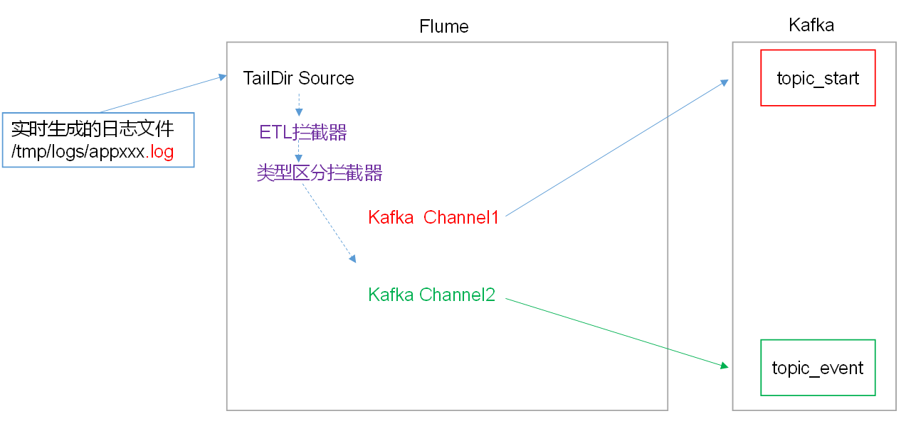

### 配置zookeeper的kafka路径

```

普通方式搭建kafka，需把集群里面的kafka/conf/server.properties
zookeeper.connect=master:2181,slave1:2181,slave2:2181/mykafka
cdh方式进入kafka配置里面配置zookeeper.chroot=master:2181,slave1:2181,slave2:2181/mykafka或/mykafka都行
配置好重启集群。
进入命令行：zkCli.sh -server master/slave1/slave2:2181
输入ls /mykafka出现厦门内容表示成功
[zk: master(CONNECTED) 1] ls /mykafka
[cluster, controller, controller_epoch, brokers, admin, isr_change_notification, consumers, log_dir_event_notification, latest_producer_id_block, config]

```


The znode in ZooKeeper used as a root for this Kafka cluster.

### kafkatool

是一个kafka连接工具，下载地址：https://www.kafkatool.com/download.html。下载安装完后按下面进行配置

```
cluster：随意
kafka cluster name：默认
zookeeper host：所有集群主机，多个就以,分割
zookeeper port：2181
chroot path：/mykafka    这里的地址可以根据自己设定的来
```

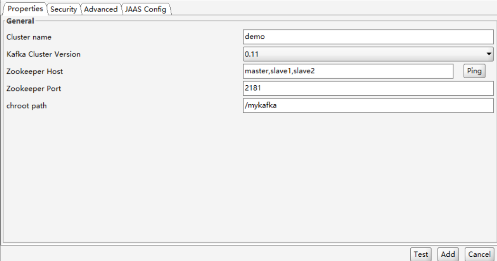

点击“add”连接成功如下

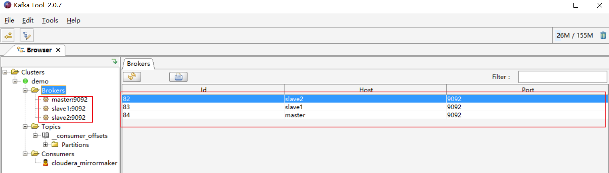

### 副本添加

添加两个主题

| 名称        | 分区partition | 副本replica |
| ----------- | ------------- | ----------- |
| topic_start | 3             | 2           |
| topic_event | 2             | 2           |

使用kafkatool添加演示

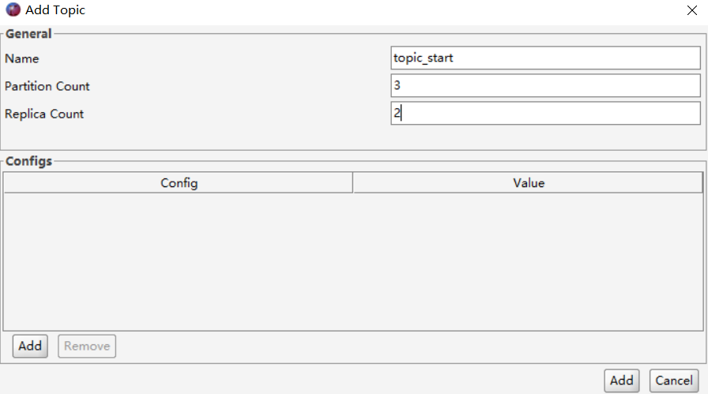


### 采集脚本概述

1、Source：数据源在日志文件中，读取日志中的数据，可以使用以下Source。
ExecSource:  可以执行一个linux命令，例如tail -f 日志文件，讲读取的到的数据封装为Event。不用，不安全，可能丢数据。
SpoolingDirSource:  可以读取一个目录中的文本文件，保证目录中无重名文件，保证目录中的文件都是封闭状态，一旦放入目录中，不能再继续写入。每个日志封闭后，才能放入到SpoolingDir，不然agent就容易出现故障！
TailDirSource: 接近实时第读取指定的文件！断点续传功能，使用此Source，使用TailDirSource。

2、Channel:
KafkaChannel：基于kafka的副本功能，提供了高可用性，event被存储在kafka中。即便agent挂掉或broker挂掉，依然可以让sink从channel中读取数据。

应用场景：
①KafkaChannel和sink和source一起使用，单纯作为channel。
②KafkaChannel+拦截器+Source，只要Source把数据写入到kafka就完成
目前使用的场景！
③KafkaChannel+sink，使用flume将kafka中的数据写入到其他的目的地，例如hdfs，为在上述场景工作，KafkaChannel可以配置生产者和消费者的参数。

配置参数：
①在channel层面的参数，例如channel的类型，channel的容量等，需要和之前一样，在channel层面配置，例如：a1.channel.k1.type
②和kafka集群相关的参数，需要在channel层面配置后，再加上kafka。
例如： 

a1.channels.k1.kafka.topic ： 向什么主题发送数据
a1.channels.k1.kafka.bootstrap.servers： 集群地址
③和Produer和Consumer相关的参数，需要加上produer和consumer的前缀：
例如：a1.channels.k1.kafka.producer.acks=all
a1.channels.k1.kafka.consumer.group.id=sire

必须的配置：
**type=org.apache.flume.channel.kafka.KafkaChannel**
**kafka.bootstrap.servers**=
可选：
**kafka.topic**： 生成到哪个主题
**parseAsFlumeEvent**=true(默认)： 
如果parseAsFlumeEvent=true，kafkaChannel会把数据以flume中Event的结构作为参考，把event中的header+body放入ProducerRecord的value中。

如果parseAsFlumeEvent=false，kafkaChannel会把数据以flume中Event的结构作为参考，把event中body放入ProducerRecord的value中。

**a1.channels.k1.kafka.producer.acks**=0		

3、拦截器
日志数据有两种类型，一种是事件日志，格式 时间戳|{"ap":xx,"cm":{},"et":[{},{}]}；另一种是启动日志，格式：{"en":"start"}。在1个source对接两个KafkaChannel时，需要使用MulitPlexing Channel Selector，将启动日志，分配到启动日志所在的Chanel，将事件日志分配到事件日志所在的Channel。MulitPlexing Channel Selector根据event，header中指定key的映射，来分配具体的Channel。需要自定义拦截器，根据不同的数据类型，在每个Event对象的header中添加key！

功能：

 ①为每个Event，在header中添加key。
②过滤不符合要求的数据(格式有损坏)。
启动日志： {},验证JSON字符串的完整性，是否以{}开头结尾。
事件日志：  时间戳|{}。
时间戳需要合法：
a)长度合法(13位)
b)都是数字
验证JSON字符串的完整性，是否以{}开头结尾。

### maven-采集拦截器

本项目中自定义了两个拦截器，分别是：ETL拦截器、日志类型区分拦截器。ETL拦截器主要用于，过滤时间戳不合法和Json数据不完整的日志。日志类型区分拦截器主要用于，将启动日志和事件日志区分开来，方便发往Kafka的不同Topic。

1）创建Maven工程flume-interceptor

2）创建包名：com.sire.flume.interceptor

3）在pom.xml文件中添加如下配置

```xml
<dependencies>
        <dependency>
            <groupId>org.apache.flume</groupId>
            <artifactId>flume-ng-core</artifactId>
            <version>1.7.0</version>
        </dependency>
    </dependencies>

    <build>
        <plugins>
            <plugin>
                <artifactId>maven-compiler-plugin</artifactId>
                <version>2.3.2</version>
                <configuration>
                    <source>1.8</source>
                    <target>1.8</target>
                </configuration>
            </plugin>
            <plugin>
                <artifactId>maven-assembly-plugin</artifactId>
                <configuration>
                    <descriptorRefs>
                        <descriptorRef>jar-with-dependencies</descriptorRef>
                    </descriptorRefs>
                </configuration>
                <executions>
                    <execution>
                        <id>make-assembly</id>
                        <phase>package</phase>
                        <goals>
                            <goal>single</goal>
                        </goals>
                    </execution>
                </executions>
            </plugin>
        </plugins>
    </build>
```

### maven-ETL拦截器MyInterceptor

在com.sire.flume.interceptor包下创建MyInterceptor类名，Flume ETL拦截器MyInterceptor。

```java
package com.sire.flume.interceptor;
import java.nio.charset.Charset;
import java.util.ArrayList;
import java.util.List;
import java.util.Map;

import org.apache.flume.Context;
import org.apache.flume.Event;
import org.apache.flume.interceptor.Interceptor;

public class MyInterceptor implements Interceptor{
   
   //创建一个放置复合要求数据的集合
   private List<Event> results=new ArrayList<>();
   
   private String startFlag="\"en\":\"start\"";

   @Override
   public void initialize() {
      
   }

   //核心方法，拦截Event
   @Override
   public Event intercept(Event event) {
      
      byte[] body = event.getBody();
      
      //在header中添加key
      Map<String, String> headers = event.getHeaders();
      
      String bodyStr = new String(body, Charset.forName("utf-8"));
      
      boolean flag=true;
      
      //符合启动日志特征
      if (bodyStr.contains(startFlag)) {
         
         headers.put("topic", "topic_start");
         
         flag=ETLUtil.validStartLog(bodyStr);
         
      }else {
         
         //事件日志
         headers.put("topic", "topic_event");
         
         flag=ETLUtil.validEventLog(bodyStr);
         
      }
      
      //如果验证结果是false
      if (!flag) {
         return null;
      }
      
      return event;
   }

   @Override
   public List<Event> intercept(List<Event> events) {
      
      //先清空results
      results.clear();
      
      for (Event event : events) {
         
         Event result = intercept(event);
         
         //有可能intercept(event)，event不符合要求，会拦截掉，返回null
         if (result !=null) {
            
            //放入合法的数据集合中
            results.add(result);
            
         }
      
      }
      
      return results;
   }

   @Override
   public void close() {
      
   }
   
    public static class Builder implements Interceptor.Builder{

       //从flume的配置文件中读取参数
      @Override
      public void configure(Context context) {
         
         
      }

      //创建一个拦截器对象
      @Override
      public Interceptor build() {
         return new MyInterceptor();
      }
       
       
    }

}
```

### maven-日志过滤工具类ETLUtil

```java
package com.sire.flume.interceptor;
import java.util.Arrays;
import java.util.List;

import org.apache.commons.lang.StringUtils;
import org.apache.commons.lang.math.NumberUtils;

public class ETLUtil {
   
   //判断启动日志是否复合格式要求
   //验证JSON字符串的完整性，是否以{}开头结尾
   public static boolean validStartLog(String source) {
      
      //判断body部分是否有数据
      if (StringUtils.isBlank(source)) {
         return false;
      }
      
      //去前后空格
      String trimStr = source.trim();
      
      //验证JSON字符串的完整性，是否以{}开头结尾
      if (trimStr.startsWith("{") && trimStr.endsWith("}")) {
         return true;
      }
      
      return false;
      
   }
   
   /*
    * 判断事件日志是否复合格式要求
    *        事件日志：  时间戳|{}
                  时间戳需要合法：
                     a)长度合法(13位)
                     b)都是数字
                  验证JSON字符串的完整性，是否以{}开头结尾
    */
   public static boolean validEventLog(String source) {
      
      //判断body部分是否有数据
      if (StringUtils.isBlank(source)) {
               return false;
      }
      
      //去前后空格
      String trimStr = source.trim();
      
      String[] words = trimStr.split("\\|");
      
      if (words.length != 2) {
         return false;
      }
      
      //判断时间戳
      // isNumber()判断值是否是数值类型 123L 0xxx
      // isDigits() 判断字符串中是否只能是0-9的数字
      if (words[0].length() !=13 || !NumberUtils.isDigits(words[0])) {
         return false;
      }
      
      //验证JSON字符串的完整性，是否以{}开头结尾
      if (words[1].startsWith("{") && words[1].endsWith("}")) {
         return true;
      }
         
         
      return false;
         
   }
   
   public static void main(String[] args) {
      
      // | 在正则表达式中有特殊含义，希望只作为|解析，需要使用转义字符
      String str="a|b|c";
      
      List<String> list = Arrays.asList(str.split("\\|"));
      
      System.out.println(list);
      
      System.out.println(list.size());
      
   }

}
```

### maven-测试

测试分为两个部分：日志过滤工具类ETLUtil测试和jar报测试。

1）日志过滤工具类ETLUtil测试

```java
public class Test {
    public static void main(String[] args) {
        String startStr="{\"action\":\"1\",\"ar\":\"MX\",\"ba\":\"Huawei\",\"detail\":\"\",\"en\":\"start\",\"entry\":\"1\",\"extend1\":\"\",\"g\":\"K4PN9ME3@gmail.com\",\"hw\":\"640*1136\",\"l\":\"es\",\"la\":\"11.3\",\"ln\":\"-90.0\",\"loading_time\":\"10\",\"md\":\"Huawei-19\",\"mid\":\"2\",\"nw\":\"WIFI\",\"open_ad_type\":\"2\",\"os\":\"8.1.2\",\"sr\":\"L\",\"sv\":\"V2.6.9\",\"t\":\"1592554377187\",\"uid\":\"2\",\"vc\":\"3\",\"vn\":\"1.0.4\"}";
        String eventStr="1592582447732|{\"cm\":{\"ln\":\"-63.9\",\"sv\":\"V2.7.2\",\"os\":\"8.1.0\",\"g\":\"2OG26E53@gmail.com\",\"mid\":\"3\",\"nw\":\"3G\",\"l\":\"en\",\"vc\":\"4\",\"hw\":\"640*1136\",\"ar\":\"MX\",\"uid\":\"3\",\"t\":\"1592486995499\",\"la\":\"-38.2\",\"md\":\"sumsung-19\",\"vn\":\"1.3.1\",\"ba\":\"Sumsung\",\"sr\":\"U\"},\"ap\":\"app\",\"et\":[{\"ett\":\"1592558189435\",\"en\":\"newsdetail\",\"kv\":{\"entry\":\"1\",\"goodsid\":\"0\",\"news_staytime\":\"0\",\"loading_time\":\"0\",\"action\":\"4\",\"showtype\":\"4\",\"category\":\"98\",\"type1\":\"542\"}},{\"ett\":\"1592509812242\",\"en\":\"loading\",\"kv\":{\"extend2\":\"\",\"loading_time\":\"12\",\"action\":\"1\",\"extend1\":\"\",\"type\":\"2\",\"type1\":\"\",\"loading_way\":\"2\"}},{\"ett\":\"1592555709876\",\"en\":\"error\",\"kv\":{\"errorDetail\":\"java.lang.NullPointerException\\\\n    at cn.lift.appIn.web.AbstractBaseController.validInbound(AbstractBaseController.java:72)\\\\n at cn.lift.dfdf.web.AbstractBaseController.validInbound\",\"errorBrief\":\"at cn.lift.dfdf.web.AbstractBaseController.validInbound(AbstractBaseController.java:72)\"}},{\"ett\":\"1592489325136\",\"en\":\"favorites\",\"kv\":{\"course_id\":7,\"id\":0,\"add_time\":\"1592525179280\",\"userid\":4}}]}";

        System.out.println(ETLUtil.validStartLog(startStr));
        System.out.println(ETLUtil.validEventLog(eventStr));
    }
}
```

如果测试结果都为true，那就是成功，代码编写没有问题。

2）jar报测试

1、将项目打包的flume-interceptor-1.0-SNAPSHOT.jar上传到flume安装目录lib下，如果是通过cdh6.2.0安装flume的话，flume安装目录是在/usr/lib/flume-ng。

2、flume安装目录下建立myagents文件夹并在文件夹内建立test.conf文件

```
mkdir myagents
vim myagents/test.conf
```

test.conf内容

```shell
#a1是agent的名称，a1中定义了一个叫r1的source，如果有多个，使用空格间隔
a1.sources = r1
a1.sinks = k1
a1.channels = c1
#组名名.属性名=属性值
a1.sources.r1.type=TAILDIR
a1.sources.r1.filegroups=f1 
#读取/tmp/logs/app-yyyy-mm-dd.log ^代表以xxx开头$代表以什么结尾 .代表匹配任意字符
#+代表匹配任意位置
a1.sources.r1.filegroups.f1=/tmp/logs/^app.+.log$
#JSON文件的保存位置，注意这里要根据自己的flume安装地址做相应修改。
a1.sources.r1.positionFile=/usr/lib/flume-ng/test/log_position.json

#定义拦截器
a1.sources.r1.interceptors = i1
#注意这里的路径要根据自己的MyInterceptor路径做相应修改。
a1.sources.r1.interceptors.i1.type = com.sire.flume.interceptor.MyInterceptor$Builder


#定义sink
a1.sinks.k1.type=logger

#定义chanel
a1.channels.c1.type=memory
a1.channels.c1.capacity=1000

#连接组件 同一个source可以对接多个channel，一个sink只能从一个channel拿数据！
a1.sources.r1.channels=c1
a1.sinks.k1.channel=c1
```

3、flume安装目录下执行

```
flume-ng agent -c conf/ -n a1 -f myagents/test.conf -Dflume.root.logger=DEBUG,console
```

出现类似下面这种无报错表示成功。

```shell
2020-06-22 00:53:36.307 [SinkRunner-PollingRunner-DefaultSinkProcessor] INFO  org.apache.flume.sink.LoggerSink - Event: { headers:{topic=topic_event} body: 31 35 39 32 35 38 32 34 34 38 37 33 38 7C 7B 22 1592582448738|{" }
2020-06-22 00:55:41.317 [PollableSourceRunner-TaildirSource-r1] INFO  org.apache.flume.source.taildir.TaildirSource - Closed file: /tmp/logs/app-2020-06-21.log, inode: 393246, pos: 9048
2020-06-22 00:55:41.318 [PollableSourceRunner-TaildirSource-r1] INFO  org.apache.flume.source.taildir.TaildirSource - Closed file: /tmp/logs/app-2020-06-22.log, inode: 393247, pos: 23498
2020-06-22 00:55:41.318 [PollableSourceRunner-TaildirSource-r1] INFO  org.apache.flume.source.taildir.TaildirSource - Closed file: /tmp/logs/app-2020-06-20.log, inode: 393241, pos: 3761
2020-06-22 00:55:46.318 [PollableSourceRunner-TaildirSource-r1] INFO  o.a.f.source.taildir.ReliableTaildirEventReader - Opening file: /tmp/logs/app-2020-06-22.log, inode: 393247, pos: 23498
```

### 数据采集f1.conf

1）flume安装目录下myagents文件夹内建立f1.conf文件

```shell
vim myagents/fl.conf
```

内容如下：

```shell
#a1是agent的名称，a1中定义了一个叫r1的source，如果有多个，使用空格间隔
a1.sources = r1
a1.channels = c1 c2

#组名名.属性名=属性值
a1.sources.r1.type=TAILDIR
a1.sources.r1.filegroups=f1
a1.sources.r1.batchSize=1000
#读取/tmp/logs/app-yyyy-mm-dd.log ^代表以xxx开头$代表以什么结尾 .代表匹配任意字符
#+代表匹配任意位置
a1.sources.r1.filegroups.f1=/tmp/logs/^app.+.log$
#JSON文件的保存位置，注意这里要根据自己的flume安装地址做相应修改。
a1.sources.r1.positionFile=/usr/lib/flume-ng/test/log_position.json

#定义拦截器
a1.sources.r1.interceptors = i1
#注意这里的路径要根据自己的MyInterceptor路径做相应修改。
a1.sources.r1.interceptors.i1.type = com.sire.flume.interceptor.MyInterceptor$Builder

#定义ChannelSelector
a1.sources.r1.selector.type = multiplexing
a1.sources.r1.selector.header = topic
a1.sources.r1.selector.mapping.topic_start = c1
a1.sources.r1.selector.mapping.topic_event = c2


#定义chanel
a1.channels.c1.type=org.apache.flume.channel.kafka.KafkaChannel
a1.channels.c1.kafka.bootstrap.servers=master:9092,slave1:9092,slave2:9092
a1.channels.c1.kafka.topic=topic_start
a1.channels.c1.parseAsFlumeEvent=false

a1.channels.c2.type=org.apache.flume.channel.kafka.KafkaChannel
a1.channels.c2.kafka.bootstrap.servers=master:9092,slave1:9092,slave2:9092
a1.channels.c2.kafka.topic=topic_event
a1.channels.c2.parseAsFlumeEvent=false

#连接组件 同一个source可以对接多个channel，一个sink只能从一个channel拿数据！
a1.sources.r1.channels=c1 c2
```

2）起两个窗口消费

```shell
kafka-console-consumer --bootstrap-server slave2:9092 --topic topic_start --from-beginning
kafka-console-consumer --bootstrap-server slave2:9092 --topic topic_event --from-beginning
```

3）删除flume安装目录test/log_position.json

```shell
rm -rf test/log_position.json
```

3）执行命令

```sehll
flume-ng agent -c conf/ -n a1 -f myagents/fl.conf -Dflume.root.logger=DEBUG,console
```

4）查看消费窗口数据，有出现下面类似数据，表示已经通过flume成功把log-conllector jar包生成在/tmp/logs/下的数据成功过滤分割到topic_start和topic_event两个topic里面。注意：通过lg脚本生成/tmp/logs/app*.log数据。

topic_start

```shell
{"action":"1","ar":"MX","ba":"HTC","detail":"102","en":"start","entry":"4","extend1":"","g":"06U756NQ@gmail.com","hw":"1080*1920","l":"pt","la":"-8.2","ln":"-117.1","loading_time":"7","md":"HTC-8","mid":"990","nw":"3G","open_ad_type":"2","os":"8.1.2","sr":"C","sv":"V2.4.8","t":"1592743376214","uid":"990","vc":"4","vn":"1.3.9"}
```

topic_event

```shell
1592769185544|{"cm":{"ln":"-98.8","sv":"V2.8.0","os":"8.0.4","g":"E58JQ6AS@gmail.com","mid":"999","nw":"WIFI","l":"es","vc":"7","hw":"640*1136","ar":"MX","uid":"999","t":"1592745671830","la":"-31.8","md":"Huawei-17","vn":"1.0.3","ba":"Huawei","sr":"I"},"ap":"app","et":[{"ett":"1592712164182","en":"display","kv":{"goodsid":"245","action":"2","extend1":"2","place":"3","category":"7"}},{"ett":"1592696830200","en":"loading","kv":{"extend2":"","loading_time":"0","action":"3","extend1":"","type":"3","type1":"","loading_way":"2"}},{"ett":"1592702935942","en":"active_foreground","kv":{"access":"1","push_id":"2"}},{"ett":"1592708360055","en":"comment","kv":{"p_comment_id":1,"addtime":"1592682261632","praise_count":404,"other_id":6,"comment_id":8,"reply_count":172,"userid":0,"content":"瓜把省谦四屡生脱玉歉纽顽咬乔淀判"}}]}
```

当然也可以通过Kafka tool查看数据总数

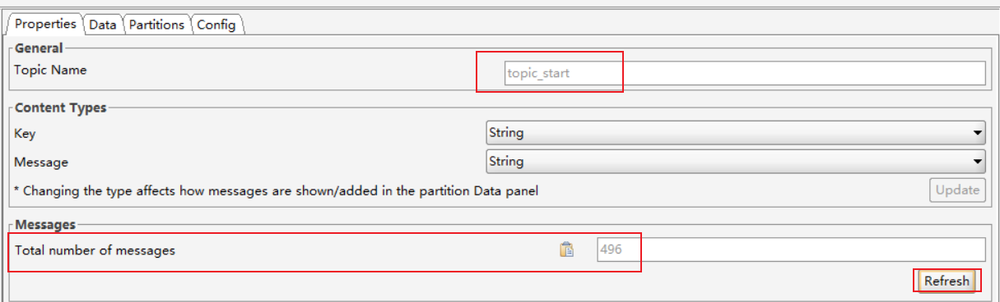

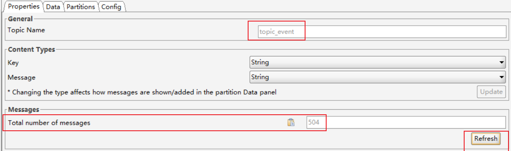

### 采集脚本f1.sh

```sh
#!/bin/bash
#使用start启动脚本，使用stop停止脚本
if(($#!=1))
then
	echo 请输入start或stop!
	exit;
fi
#定义cmd用来保存要执行的命令
cmd=cmd
if [ $1 = start ]
then
	cmd="nohup flume-ng agent -c $FLUME_HOME/conf/ -n a1 -f $FLUME_HOME/myagents/f1.conf -Dflume.root.logger=DEBUG,console > /root/sc/f1.log 2>&1 &"

	elif [ $1 = stop ]
		then 
			cmd="ps -ef  | grep f1.conf | grep -v grep | awk  '{print \$2}' | xargs kill -9"
	else
		echo 请输入start或stop!
fi

#在slave1和slave2开启采集
for i in slave1 slave2
do
	ssh $i $cmd
done
```

增加权限

```
chmod +x /root/bin/f1.sh
```

执行

```
f1.sh start
```

查看效果：都有Application

```
[root@slave1 ~]# jpsall
========== master ==========
29248 RunJar
30977 StandaloneSessionClusterEntrypoint
26404 NameNode
26406 SecondaryNameNode
902 Main
9127 Jps
27656 TaskManagerRunner
25678 Kafka
30131 EmbeddedOozieServer
26227 QuorumPeerMain
2457 Application
27897 ResourceManager
30107 EventCatcherService
27899 JobHistoryServer
30108 Main
28925 HistoryServer
30109 Main
27901 HMaster
29246 RunJar
30110 AlertPublisher
0
========== slave1 ==========
10928 KafkaEagle
6753 NodeManager
1123 
6755 HRegionServer
3635 Kafka
8340 Jps
6757 RESTServer
6744 ThriftServer
12076 Application
5996 DataNode
5852 QuorumPeerMain
0
========== slave2 ==========
22800 QuorumPeerMain
5285 Jps
22806 DataNode
9031 Application
22824 NodeManager
1129 
31323 ConsoleConsumer
1502 Kafka
0
```

### jpsall

```bash
#!/bin/bash
for i in master slave1 slave2
do
echo "========== $i ==========" 
ssh $i '/usr/java/jdk1.8.0_181-cloudera/bin/jps'
echo $?
done
```

### 测试

先查看两个topic总数是417+383=800。

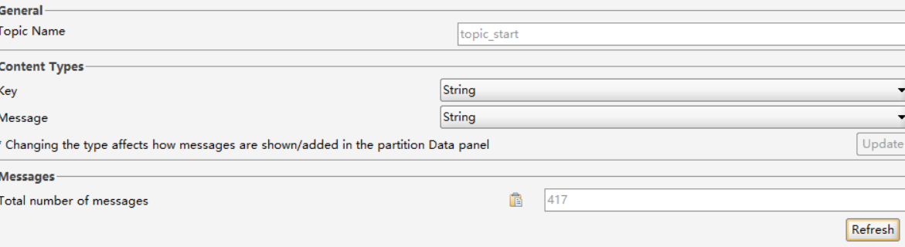

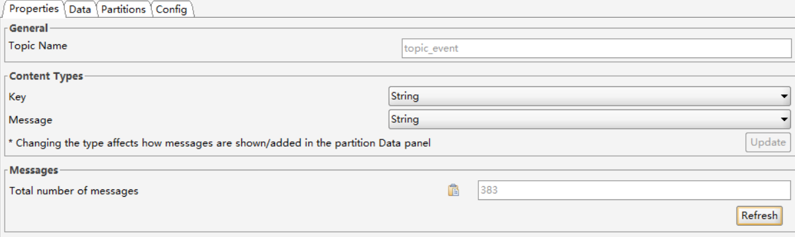

再执行下面命令：

```shell
rm -rf /tmp/logs/*
lg 20 1200  #分别在slave1和slave2上每隔20毫秒，生成1200条数据，也就是说总共生成2400
# 起另外一个窗口查看日志
tail -f /root/sc/f1.log
f1.sh start #启动这个命令如果f1.log没有报错表示没有问题
```

再来查看kafka tool：1573+1627=3200=800（原来的数量）+2400（增加的数量）

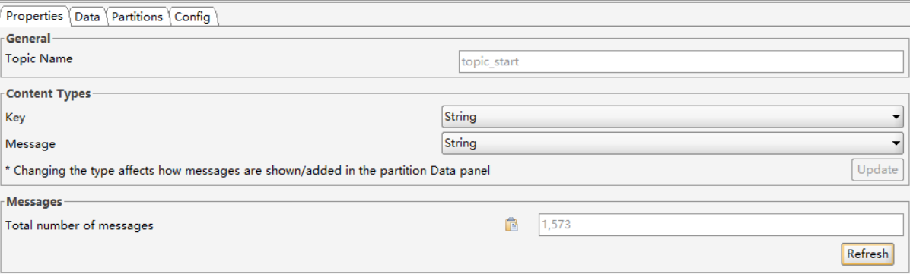

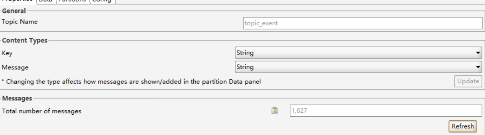

### 总结

从本机读取/tmp/logs中的日志数据， 通过flume，传输到kafka中。

1、保证/tmp/logs中有类似app-2020-06-10.1og这样的文件（使用lg脚本生成）。

2、使用taildirsource，taildirsource会将上次读取数据的位置记录在json文件中，可以查看json文件是否更新， 判断是否新读取了数据。

```
cat $FLUME_HOME/test/log_position.json
```

3、flume agent的工作原理

source---->拦截器(ETL为header添加topic=topic start I topic event)定20-->MuliplexingChannelSelector(根据自己配置的映射信息， 讲指定的event分配到channel中）。

4、如果日志文件有数据， 启动flume后，kafka没有数据？

1）检查kafka集群是否正常。

2）手动创建topic_start， topic_event。

3）验证拦截器是否可以为header添加topic topic_start和topic_event，运行test.conf。

4）检查f1.conf中是否有参数编写问题。

5）判断MuliplexingChannelSelector的映射是否映射对。

## 用户行为数据-第二层采集通道

设计分析

目的：将已经存储在kafka集群中的数据，使用flume上传到HDFS。

数据源在kafka，因此需要使用一个可以对接kafka的source，即kafkaSource。为了安全起见，推荐选择filechannel，目的地在hdfs，使用hdfssink。可自行尝试，kafkaChannel+hdfssink。

### kafkaSource

kafkaSource就是kafka的一个消费者线程，可以从指定的主题中读取数据。如果希望提供消费的速率，可以配置多个kafkaSource，这些source组成同一个组。kafkaSource在工作时，会检查event的header中有没有timestamp属性，如果没有，kafkaSource会自动为event添加timestamp=当前kafkaSource所在机器的时间。kafkaSource启动一个消费者，消费者在消费时，默认从分区的最后一个位置消费。

必须的配置：
type=org.apache.flume.source.kafka.KafkaSource
kafka.bootstrap.servers=master:9092,slave1:9092,slave2:9092
kafka.topics=消费的主题
kafka.topics.regex=使用正则表达式匹配主题

可选的配置：
kafka.consumer.group.id=消费者所在的组id
batchSize=一次put多少数据，小于10000
batchDurationMillis=一次put可以最多使用多少时间

和kafkaConsumer相关的属性：kafka.consumer=consumer的属性名，例如：kafka.consumer.auto.offset.reset

### fileChannel

channel中的所有event是存储在文件中，因此在程序关闭或机器宕机的情况下不会丢失数据。比memorychannel可靠，但是效率略低。
必须的配置：
type=file
checkpointDir=checkpoint线程(负责检查文件中哪些event已经被sink消费了，将这些event的文件删除)保存数据的目录。
useDualCheckpoints=false 是否启动双检查点，如果启动后，会再启动一个备用的checkpoint线程。如果改为true，还需要设置backupCheckpointDir(备用的checkpoint线程的工作目录)。
dataDirs= event保存目录，默认为~/.flume/file-channel/data，可以是逗号分割的多个目录。

hdfssink:      hdfssink将event写入到HDFS。目前只支持生成两种类型的文件： text和sequenceFile，这两种文件都可以使用压缩。写入到HDFS的文件可以自动滚动（关闭当前正在写的文件，创建一个新文件）。基于时间、events的数量、数据大小进行周期性的滚动，支持基于时间和采集数据的机器进行分桶和分区操作。HDFS数据所上传的目录或文件名可以包含一个格式化的转义序列，这个路径或文件名会在上传event时，被自动替换，替换为完整的路径名。使用此Sink要求本机已经安装了hadoop，或持有hadoop的jar包。
配置：	
必须配置：
type	–	The component type name, needs to be hdfs
hdfs.path	–	HDFS directory path (eg hdfs://namenode/flume/webdata/)

参考：

```shell
a1.sinks.k1.type = hdfs
#一旦路径中含有基于时间的转义序列，要求event的header中必须有timestamp=时间戳，如果没有需要将useLocalTimeStamp = true
a1.sinks.k1.hdfs.path = hdfs://master:9000/flume/%Y%m%d/%H/%M
#上传文件的前缀
a1.sinks.k1.hdfs.filePrefix = logs-

#以下三个和目录的滚动相关，目录一旦设置了时间转义序列，基于时间戳滚动
#是否将时间戳向下舍
a1.sinks.k1.hdfs.round = true
#多少时间单位创建一个新的文件夹
a1.sinks.k1.hdfs.roundValue = 1
#重新定义时间单位
a1.sinks.k1.hdfs.roundUnit = minute

#是否使用本地时间戳
a1.sinks.k1.hdfs.useLocalTimeStamp = true
#积攒多少个Event才flush到HDFS一次
a1.sinks.k1.hdfs.batchSize = 100

#以下三个和文件的滚动相关，以下三个参数是或的关系！以下三个参数如果值为0都代表禁用！
#60秒滚动生成一个新的文件
a1.sinks.k1.hdfs.rollInterval = 10
#设置每个文件到128M时滚动
a1.sinks.k1.hdfs.rollSize = 134217700
#每写多少个event滚动一次
a1.sinks.k1.hdfs.rollCount = 0
#以不压缩的文本形式保存数据
a1.sinks.k1.hdfs.fileType=DataStream
```

### test2.conf

```
#配置文件编写
a1.sources = r1 r2
a1.sinks = k1 k2
a1.channels = c1 c2

#配置source
a1.sources.r1.type=org.apache.flume.source.kafka.KafkaSource
a1.sources.r1.kafka.bootstrap.servers=hadoop102:9092,hadoop103:9092,hadoop104:9092
a1.sources.r1.kafka.topics=topic_start
a1.sources.r1.kafka.consumer.auto.offset.reset=earliest
a1.sources.r1.kafka.consumer.group.id=CG_Start

a1.sources.r2.type=org.apache.flume.source.kafka.KafkaSource
a1.sources.r2.kafka.bootstrap.servers=hadoop102:9092,hadoop103:9092,hadoop104:9092
a1.sources.r2.kafka.topics=topic_event
a1.sources.r2.kafka.consumer.auto.offset.reset=earliest
a1.sources.r2.kafka.consumer.group.id=CG_Event
#配置channel
a1.channels.c1.type=file
a1.channels.c1.checkpointDir=/opt/module/flume/c1/checkpoint
#启动备用checkpoint
a1.channels.c1.useDualCheckpoints=true
a1.channels.c1.backupCheckpointDir=/opt/module/flume/c1/backupcheckpoint
#event存储的目录
a1.channels.c1.dataDirs=/opt/module/flume/c1/datas


a1.channels.c2.type=file
a1.channels.c2.checkpointDir=/opt/module/flume/c2/checkpoint
a1.channels.c2.useDualCheckpoints=true
a1.channels.c2.backupCheckpointDir=/opt/module/flume/c2/backupcheckpoint
a1.channels.c2.dataDirs=/opt/module/flume/c2/datas


#定义sink
a1.sinks.k1.type=logger
a1.sinks.k2.type=logger

#连接组件
a1.sources.r1.channels=c1
a1.sources.r2.channels=c2
a1.sinks.k1.channel=c1
a1.sinks.k2.channel=c2
```


### 数据采集f2.conf

创建文件夹

```
mkdir 
```


```shell
#配置文件编写
a1.sources = r1 r2
a1.sinks = k1 k2
a1.channels = c1 c2

#配置source
a1.sources.r1.type=org.apache.flume.source.kafka.KafkaSource
a1.sources.r1.kafka.bootstrap.servers=master:9092,slave1:9092,slave2:9092
a1.sources.r1.kafka.topics=topic_start
# 配置source从最开始的位置消费，不配置的话默认从最新的消费
a1.sources.r1.kafka.consumer.auto.offset.reset=earliest
a1.sources.r1.kafka.consumer.group.id=CG_Start

a1.sources.r2.type=org.apache.flume.source.kafka.KafkaSource
a1.sources.r2.kafka.bootstrap.servers=master:9092,slave1:9092,slave2:9092
a1.sources.r2.kafka.topics=topic_event
# 配置source从最开始的位置消费，不配置的话默认从最新的消费
a1.sources.r2.kafka.consumer.auto.offset.reset=earliest
a1.sources.r2.kafka.consumer.group.id=CG_Event
#配置channel
a1.channels.c1.type=file
a1.channels.c1.checkpointDir=/usr/lib/flume-ng/c1/checkpoint
#启动备用checkpoint
a1.channels.c1.useDualCheckpoints=true
a1.channels.c1.backupCheckpointDir=/usr/lib/flume-ng/c1/backupcheckpoint
#event存储的目录
a1.channels.c1.dataDirs=/usr/lib/flume-ng/c1/datas


a1.channels.c2.type=file
a1.channels.c2.checkpointDir=/usr/lib/flume-ng/c2/checkpoint
a1.channels.c2.useDualCheckpoints=true
a1.channels.c2.backupCheckpointDir=/usr/lib/flume-ng/c2/backupcheckpoint
a1.channels.c2.dataDirs=/usr/lib/flume-ng/c2/datas


#sink
a1.sinks.k1.type = hdfs
#一旦路径中含有基于时间的转义序列，要求event的header中必须有timestamp=时间戳，如果没有需要将useLocalTimeStamp = true
a1.sinks.k1.hdfs.path = hdfs://master:9000/origin_data/gmall/log/topic_start/%Y-%m-%d
a1.sinks.k1.hdfs.filePrefix = logstart-

a1.sinks.k1.hdfs.batchSize = 1000

#文件的滚动
#60秒滚动生成一个新的文件
a1.sinks.k1.hdfs.rollInterval = 30
#设置每个文件到128M时滚动
a1.sinks.k1.hdfs.rollSize = 134217700
#禁用基于event数量的文件滚动策略
a1.sinks.k1.hdfs.rollCount = 0
#指定文件使用LZO压缩格式
a1.sinks.k1.hdfs.fileType = CompressedStream 
a1.sinks.k1.hdfs.codeC = lzop
#a1.sinks.k1.hdfs.round = true
#a1.sinks.k1.hdfs.roundValue = 10
#a1.sinks.k1.hdfs.roundUnit = second


a1.sinks.k2.type = hdfs
a1.sinks.k2.hdfs.path = hdfs://master:9000/origin_data/gmall/log/topic_event/%Y-%m-%d
a1.sinks.k2.hdfs.filePrefix = logevent-
a1.sinks.k2.hdfs.batchSize = 1000
a1.sinks.k2.hdfs.rollInterval = 30
a1.sinks.k2.hdfs.rollSize = 134217700
a1.sinks.k2.hdfs.rollCount = 0
a1.sinks.k2.hdfs.fileType = CompressedStream 
a1.sinks.k2.hdfs.codeC = lzop
#a1.sinks.k2.hdfs.round = true
#a1.sinks.k2.hdfs.roundValue = 10
#a1.sinks.k2.hdfs.roundUnit = second

#连接组件
a1.sources.r1.channels=c1
a1.sources.r2.channels=c2
a1.sinks.k1.channel=c1
a1.sinks.k2.channel=c2
```

### 采集脚本f2.sh

```
#!/bin/bash
#使用start启动脚本，使用stop停止脚本
if(($#!=1))
then
	echo 请输入start或stop!
	exit;
fi


if [ $1 = start ]
then
	ssh slave1 "nohup flume-ng agent -c $FLUME_HOME/conf/ -n a1 -f $FLUME_HOME/myagents/f2.conf -Dflume.root.logger=INFO,console > /root/sc/f2.log 2>&1 &"

	elif [ $1 = stop ]
		then 
			ssh slave1 "ps -ef  | grep f2.conf | grep -v grep | awk  '{print \$2}' | xargs kill -9"
	else
		echo 请输入start或stop!
fi
```

### 测试

```
f2 
```


### 调试分析

kafkaSource------>FileChannel------>HDFSSink
1.数据
①保证topic_start和topic_event主题中有数据。


②验证kafkaSource------>FileChannel是否有问题
查看消费者组是否有lag！
或运行test2.conf，使用loggersink看是否在控制台有数据的输出

验证时，需要注意，每次消费了数据后，当前消费者组都会提交offset!
下次只会从之前的offset继续消费，因此，可以尝试重置offset
③验证FileChannel------>HDFSSink是否有问题
遇到问题可以尝试讲日志级别设置 WARN，方便调试！

2.如何造其他日期的数据
数据的日期取决于kafkaSource所运行机器的时间！

①先修改dt,让dt脚本也可以同步104的时间
如果要造 2019-1-1，2019-1-20,2019-2-11,2019-2-22的数据
此时
②从以上时间中选取最小的时间2019-1-1，执行dt 2019-1-1，讲所有的集群时间同步为
2019-1-1，启动集群(hdfs,kafka)
③造日志
lg ------>/tmp/logs/app-2019-1-1.log
④启动f1,f2


2019-2-22 启动了kafka集群，此时集群会有一个时间戳2019-2-22 
此时修改时间为2019-1-22，如果没有重启kafka集群，此时，生产者在f1运行，
f1的时间为2019-1-22，而kafka集群的时间依然是2019-2-22,此时生成数据，就会生成超时！

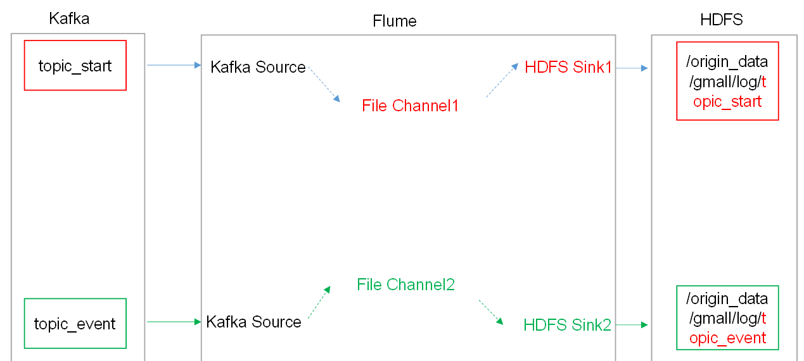


## 用户行为数据-第一二层采集通道

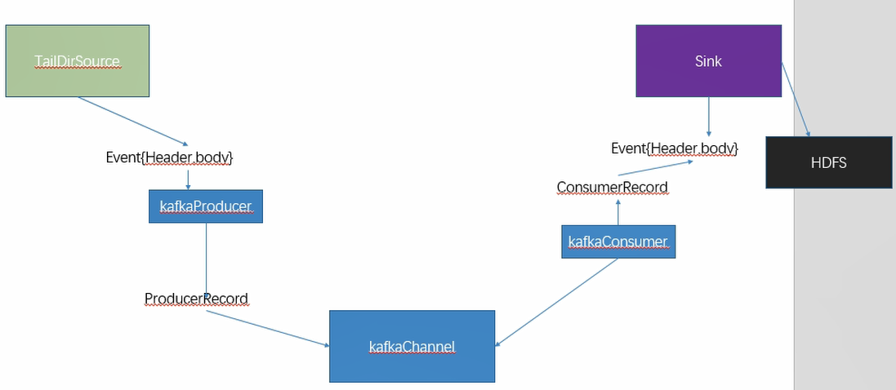
			


## 3.3 采集电商业务数据

### 3.3.1 业务数据生成

通过MySQL操作可视化工具SQLyog连接MySQL。


### 3.3.2 建表语句

1）通过SQLyog创建数据库gmall

2）设置数据库编码

​     

3）导入数据库结构脚本（**gmall2020-03-16.sql**）

### 3.3.3 生成业务数据

1）在hadoop102的/opt/module/目录下创建db_log文件夹

[atguigu@hadoop102 module]$ mkdir db_log/

2）把gmall-mock-db-2020-03-16-SNAPSHOT.jar和 application.properties上传到hadoop102的/opt/module/db_log路径上。

3）根据需求修改application.properties相关配置

logging.level.root=info

 

spring.datasource.driver-class-name=com.mysql.jdbc.Driver

spring.datasource.url=jdbc:mysql://hadoop102:3306/gmall?characterEncoding=utf-8&useSSL=false&serverTimezone=GMT%2B8

spring.datasource.username=root

spring.datasource.password=000000

 

logging.pattern.console=%m%n

 

mybatis-plus.global-config.db-config.field-strategy=not_null

 

\#业务日期

mock.date=2020-03-10

\#是否重置

mock.clear=1

 

\#是否生成新用户

mock.user.count=50

\#男性比例

mock.user.male-rate=20

 

\#收藏取消比例

mock.favor.cancel-rate=10

\#收藏数量

mock.favor.count=100

 

\#购物车数量

mock.cart.count=10

\#每个商品最多购物个数

mock.cart.sku-maxcount-per-cart=3

 

\#用户下单比例

mock.order.user-rate=80

\#用户从购物中购买商品比例

mock.order.sku-rate=70

\#是否参加活动

mock.order.join-activity=1

\#是否使用购物券

mock.order.use-coupon=1

\#购物券领取人数

mock.coupon.user-count=10

 

\#支付比例

mock.payment.rate=70

\#支付方式 支付宝：微信 ：银联

mock.payment.payment-type=30:60:10

 

\#评价比例 好：中：差：自动

mock.comment.appraise-rate=30:10:10:50

 

\#退款原因比例：质量问题 商品描述与实际描述不一致 缺货 号码不合适 拍错 不想买了 其他

mock.refund.reason-rate=30:10:20:5:15:5:5

4）并在该目录下执行，如下命令，生成2020-03-10日期数据：

[atguigu@hadoop102 db_log]$ java -jar gmall-mock-db-2020-03-16-SNAPSHOT.jar

5）在配置文件application.properties中修改

mock.date=2020-03-11

mock.clear=0

6）再次执行命令，生成2020-03-11日期数据：

[atguigu@hadoop102 db_log]$ java -jar gmall-mock-db-2020-03-16-SNAPSHOT.jar

 

### 3.3.4 脚本编写

1）在/home/atguigu/bin目录下创建

[atguigu@hadoop102 bin]$ vim mysql_to_hdfs.sh

添加如下内容：

\#! /bin/bash

 

sqoop=/opt/module/sqoop/bin/sqoop

do_date=`date -d '-1 day' +%F`

 

if [[ -n "$2" ]]; then

  do_date=$2

fi

 

import_data(){

$sqoop import \

--connect jdbc:mysql://hadoop102:3306/gmall \

--username root \

--password 000000 \

--target-dir /origin_data/gmall/db/$1/$do_date \

--delete-target-dir \

--query "$2 and \$CONDITIONS" \

--num-mappers 1 \

--fields-terminated-by '\t' \

--compress \

--compression-codec lzop \

--null-string '\\N' \

--null-non-string '\\N'

 

hadoop jar /opt/module/hadoop-2.7.2/share/hadoop/common/hadoop-lzo-0.4.20.jar com.hadoop.compression.lzo.DistributedLzoIndexer /origin_data/gmall/db/$1/$do_date

}

 

import_order_info(){

 import_data order_info "select

​              id, 

​              final_total_amount, 

​              order_status, 

​              user_id, 

​              out_trade_no, 

​              create_time, 

​              operate_time,

​              province_id,

​              benefit_reduce_amount,

​               original_total_amount,

​              feight_fee   

​            from order_info

​            where (date_format(create_time,'%Y-%m-%d')='$do_date'

​            or date_format(operate_time,'%Y-%m-%d')='$do_date')"

}

 

import_coupon_use(){

 import_data coupon_use "select

​             id,

​             coupon_id,

​             user_id,

​             order_id,

​              coupon_status,

​             get_time,

​             using_time,

​             used_time

​            from coupon_use

​            where (date_format(get_time,'%Y-%m-%d')='$do_date'

​             or date_format(using_time,'%Y-%m-%d')='$do_date'

​            or date_format(used_time,'$Y-%m-%d')='$do_date')"

}

 

import_order_status_log(){

 import_data order_status_log "select

​                 id,

​                  order_id,

​                 order_status,

​                 operate_time

​                from order_status_log

​                where date_format(operate_time,'%Y-%m-%d')='$do_date'"

}

 

import_activity_order(){

 import_data activity_order "select

​                id,

​                activity_id,

​                order_id,

​                create_time

​                from activity_order

​               where date_format(create_time,'%Y-%m-%d')='$do_date'"

}

 

import_user_info(){

 import_data "user_info" "select 

​              id,

​              name,

​              birthday,

​              gender,

​              email,

​              user_level, 

​              create_time,

​              operate_time

​              from user_info 

​             where (DATE_FORMAT(create_time,'%Y-%m-%d')='$do_date' 

​             or DATE_FORMAT(operate_time,'%Y-%m-%d')='$do_date')"

}

 

import_order_detail(){

 import_data order_detail "select 

​               od.id,

​               order_id, 

​               user_id, 

​               sku_id,

​               sku_name,

​               order_price,

​                sku_num, 

​               od.create_time 

​              from order_detail od

​              join order_info oi

​              on od.order_id=oi.id

​              where DATE_FORMAT(od.create_time,'%Y-%m-%d')='$do_date'"

}

 

import_payment_info(){

 import_data "payment_info" "select 

​                id, 

​                out_trade_no, 

​                order_id, 

​                 user_id, 

​                alipay_trade_no, 

​                total_amount, 

​                subject, 

​                payment_type, 

​                payment_time 

​               from payment_info 

​               where DATE_FORMAT(payment_time,'%Y-%m-%d')='$do_date'"

}

 

import_comment_info(){

 import_data comment_info "select

​               id,

​               user_id,

​               sku_id,

​               spu_id,

​               order_id,

​               appraise,

​                comment_txt,

​               create_time

​              from comment_info

​              where date_format(create_time,'%Y-%m-%d')='$do_date'"

}

 

import_order_refund_info(){

 import_data order_refund_info "select

​                id,

​                user_id,

​                order_id,

​                sku_id,

​                refund_type,

​                refund_num,

​                 refund_amount,

​                refund_reason_type,

​                create_time

​               from order_refund_info

​               where date_format(create_time,'%Y-%m-%d')='$do_date'"

}

 

import_sku_info(){

 import_data sku_info "select 

​             id,

​             spu_id,

​             price,

​             sku_name,

​             sku_desc,

​             weight,

​             tm_id,

​             category3_id,

​             create_time

​            from sku_info where 1=1"

}

 

import_base_category1(){

 import_data "base_category1" "select 

​                 id,

​                 name 

​                from base_category1 where 1=1"

}

 

import_base_category2(){

 import_data "base_category2" "select

​                 id,

​                 name,

​                 category1_id 

​                from base_category2 where 1=1"

}

 

import_base_category3(){

 import_data "base_category3" "select

​                 id,

​                 name,

​                 category2_id

​                from base_category3 where 1=1"

}

 

import_base_province(){

 import_data base_province "select

​                id,

​               name,

​               region_id,

​               area_code,

​               iso_code

​              from base_province

​               where 1=1"

}

 

import_base_region(){

 import_data base_region "select

​               id,

​               region_name

​              from base_region

​              where 1=1"

}

 

import_base_trademark(){

 import_data base_trademark "select

​                tm_id,

​                tm_name

​               from base_trademark

​               where 1=1"

}

 

import_spu_info(){

 import_data spu_info "select

​              id,

​              spu_name,

​              category3_id,

​              tm_id

​             from spu_info

​             where 1=1"

}

 

import_favor_info(){

 import_data favor_info "select

​             id,

​             user_id,

​             sku_id,

​             spu_id,

​             is_cancel,

​             create_time,

​             cancel_time

​            from favor_info

​            where 1=1"

}

 

import_cart_info(){

 import_data cart_info "select

​            id,

​            user_id,

​            sku_id,

​            cart_price,

​            sku_num,

​            sku_name,

​            create_time,

​            operate_time,

​            is_ordered,

​            order_time

​           from cart_info

​           where 1=1"

}

 

import_coupon_info(){

 import_data coupon_info "select

​             id,

​             coupon_name,

​             coupon_type,

​             condition_amount,

​             condition_num,

​             activity_id,

​             benefit_amount,

​             benefit_discount,

​             create_time,

​             range_type,

​             spu_id,

​             tm_id,

​             category3_id,

​             limit_num,

​             operate_time,

​             expire_time

​            from coupon_info

​            where 1=1"

}

 

import_activity_info(){

 import_data activity_info "select

​               id,

​               activity_name,

​               activity_type,

​               start_time,

​               end_time,

​               create_time

​              from activity_info

​              where 1=1"

}

 

import_activity_rule(){

  import_data activity_rule "select

​                  id,

​                  activity_id,

​                  condition_amount,

​                  condition_num,

​                  benefit_amount,

​                  benefit_discount,

​                  benefit_level

​                from activity_rule

​                where 1=1"

}

 

import_base_dic(){

  import_data base_dic "select

​              dic_code,

​              dic_name,

​              parent_code,

​              create_time,

​              operate_time

​             from base_dic

​             where 1=1" 

}

 

case $1 in

 "order_info")

   import_order_info

;;

 "base_category1")

   import_base_category1

;;

 "base_category2")

   import_base_category2

;;

 "base_category3")

   import_base_category3

;;

 "order_detail")

   import_order_detail

;;

 "sku_info")

   import_sku_info

;;

 "user_info")

   import_user_info

;;

 "payment_info")

   import_payment_info

;;

 "base_province")

   import_base_province

;;

 "base_region")

   import_base_region

;;

 "base_trademark")

   import_base_trademark

;;

 "activity_info")

   import_activity_info

;;

 "activity_order")

   import_activity_order

;;

 "cart_info")

   import_cart_info

;;

 "comment_info")

   import_comment_info

;;

 "coupon_info")

   import_coupon_info

;;

 "coupon_use")

   import_coupon_use

;;

 "favor_info")

   import_favor_info

;;

 "order_refund_info")

   import_order_refund_info

;;

 "order_status_log")

   import_order_status_log

;;

 "spu_info")

   import_spu_info

;;

 "activity_rule")

   import_activity_rule

;;

 "base_dic")

   import_base_dic

;;

 

"first")

  import_base_category1

  import_base_category2

  import_base_category3

  import_order_info

  import_order_detail

  import_sku_info

  import_user_info

  import_payment_info

  import_base_province

  import_base_region

  import_base_trademark

  import_activity_info

  import_activity_order

  import_cart_info

  import_comment_info

  import_coupon_use

  import_coupon_info

  import_favor_info

  import_order_refund_info

  import_order_status_log

  import_spu_info

  import_activity_rule

  import_base_dic

;;

"all")

  import_base_category1

  import_base_category2

  import_base_category3

  import_order_info

  import_order_detail

  import_sku_info

  import_user_info

  import_payment_info

  import_base_trademark

  import_activity_info

  import_activity_order

  import_cart_info

  import_comment_info

  import_coupon_use

  import_coupon_info

  import_favor_info

  import_order_refund_info

  import_order_status_log

  import_spu_info

  import_activity_rule

  import_base_dic

;;

esac

说明1：

[ -n 变量值 ] 判断变量的值，是否为空

-- 变量的值，非空，返回true

-- 变量的值，为空，返回false

说明2：

查看date命令的使用，[atguigu@hadoop102 ~]$ date --help

2）修改脚本权限 

[atguigu@hadoop102 bin]$ chmod 777 mysql_to_hdfs.sh

3）初次导入

[atguigu@hadoop102 bin]$ mysql_to_hdfs.sh first 2020-03-10

4）每日导入

[atguigu@hadoop102 bin]$ mysql_to_hdfs.sh all 2020-03-11

 