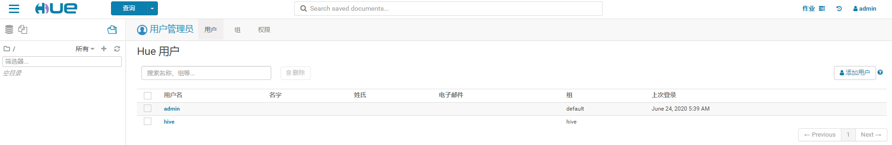

# cdh6.2.1搭建

全称：Cloudera’s Distribution Including Apache Hadoop，Cloudera 公司的Hadoop版本，包含大数据组件和监控管理工具（Cloudera Manager)两部分。

## 简介

Cloudera Manager是一个拥有集群自动化安装、中心化管理、集群监控、报警功能的一个工具，使得安装集群从几天的时间缩短在几个小时内，运维人员从数十人降低到几人以内，极大的提高集群管理的效率。

架构


说明：

1）Cloudera Repository：软件由Cloud era管理分布存储库。(有点类似Maven的中心仓库)

2）Server：负责软件安装、配置，启动和停止服务，管理服务运行的群集。

3）Management Service：由一组执行各种监控， 警报和报告功能角色的服务。

4）Database：存储配置和监视信息。

5）Agent：安装在每台主机上。负责启动和停止的过程，配置，监控主机。

6）Clients：是用于与服务器进行交互的接口(API和Admin Console)。

大数据集群搭建方式选择

1、逐个安装大数据组件：
优点：灵活，深入各组件安装细节
缺点：繁琐，无统一监控、管理工具

2、使用CDH，Ambari管理工具安装：
优点：一站式安装大部分组件，提供监控、管理功能
缺点：需要更多的资源，安装过程有一定复杂性

建议：机器资源足够则使用CDH方式，否则使用逐个安装方式

## 部署准备

准备三台centos Linux 7.2，硬盘都是100G，master4核16G；slave1和slave2都是2核8G。下面操作中如果操作涉及三台后面会加（三台）。

### 修改hostname（三台）

三台机器对应分别修改为master、slave1、slave2，重启通过hostname验证。

```
vim /etc/hostname
[root@master ~]# hostname
master
```

### 修改hosts（三台）

内容一致。

```
[root@master ~]# vim /etc/hosts

127.0.0.1   localhost localhost.localdomain localhost4 localhost4.localdomain4
::1         localhost localhost.localdomain localhost6 localhost6.localdomain6
172.31.82.11 master
172.31.82.12 slave1
172.31.82.13 slave2
```

### 关闭SELinux及防火墙（三台）

1.关闭SELinux:  

```
vim /etc/selinux/config
SELINUX=disabled
```

2. 关闭防火墙：

```
systemctl stop firewalld
systemctl disable firewalld
```

### ssh免密登录（三台）

```
1.生成密钥：
ssh-keygen -t rsa（默认位于 ~/.ssh/）
2. 拷贝公钥到所有机器：
ssh-copy-id root@master
ssh-copy-id root@slave1
ssh-copy-id root@slave2
3.测试免密登录：
ssh master
ssh slave1
ssh slave2
```

### 同步脚本xsync（三台）

```
[root@master ~]# vim bin/xsync 

#!/bin/bash
#1 获取输入参数个数，如果没有参数，直接退出
pcount=$#
if((pcount==0)); then
echo no args;
exit;
fi

#2 获取文件名称
p1=$1
fname=`basename $p1`
echo fname=$fname

#3 获取上级目录到绝对路径
pdir=`cd -P $(dirname $p1); pwd`
echo pdir=$pdir

#4 获取当前用户名称
user=`whoami`

#5 循环
for i in master slave1 slave2
do
        echo ------------------- $i --------------
        rsync -av $pdir/$fname $user@$i:$pdir
done
```

增加权限且同步到三台服务器

```
chomd +x /root/bin/xsync 
xsync /root/bin/xsync
```

### 集群整体操作脚本xcall（三台）

```
[root@master ~]# vim bin/xcall 

#!/bin/bash
#验证参数
if(($#==0))
then
        echo 请传入要执行的命令!
        exit;
fi

echo "要执行的命令是:$@"

#批量执行
for i in master slave1 slave2
do
        echo -----------------------$i---------------------
        echo $i $@
        ssh  $i $@
done
```

增加权限且同步到三台服务器

```
chomd +x /root/bin/xcall
xsync /root/bin/xcall
```

### ntp安装（三台）

1.安装ntp

```
yum –y install ntp
```

2.启动并设置NTP服务开机启动

```
systemctl start ntpd
systemctl enable ntpd
```

### 时间同步ntp（master）

将master设置为主服务器（在master节点操作）：

```
mv /etc/ntp.conf /etc/ntp.conf.bak
vim /etc/ntp.conf #内容如下
driftfile /var/lib/ntp/ntp.drift #草稿文件
# 允许内网其他机器同步时间（192.168.0.1 修改为自己的ip掩码）
restrict 172.31.82.1  mask 255.255.255.0 nomodify notrap
 
# Use public servers from the pool.ntp.org project.
# 中国这边最活跃的时间服务器 : [http://www.pool.ntp.org/zone/cn](http://www.pool.ntp.org/zone/cn)
server 210.72.145.44 perfer   # 中国国家受时中心
server 202.112.10.36             # 1.cn.pool.ntp.org
server 59.124.196.83             # 0.asia.pool.ntp.org
 
# allow update time by the upper server 
# 允许上层时间服务器主动修改本机时间
restrict 210.72.145.44 nomodify notrap noquery
restrict 202.112.10.36 nomodify notrap noquery
restrict 59.124.196.83 nomodify notrap noquery
 
# 外部时间服务器不可用时，以本地时间作为时间服务
server  127.127.1.0     # local clock
fudge   127.127.1.0 stratum 10
重启服务：
3. 手动同步：

```

ntp重启

```
systemctl restart ntpd
```

手动同步

```
[root@master ~]# ntpdate -u master
24 Jun 06:50:57 ntpdate[11686]: adjust time server 172.31.82.11 offset -0.000004 sec
```

### 时间同步ntp（slave1，slave2）

```
vim /etc/ntp.conf，内容如下：
driftfile /var/lib/ntp/ntp.drift # 草稿文件

statsdir /var/log/ntpstats/
statistics loopstats peerstats clockstats
filegen loopstats file loopstats type day enable
filegen peerstats file peerstats type day enable
filegen clockstats file clockstats type day enable

# 让NTP Server为内网的ntp服务器（ server和fudge修改为master节点ip）
server 172.31.82.11
fudge 172.31.82.11 stratum 5

# 不允许来自公网上ipv4和ipv6客户端的访问
restrict -4 default kod notrap nomodify nopeer noquery 
restrict -6 default kod notrap nomodify nopeer noquery

# Local users may interrogate the ntp server more closely.
restrict 127.0.0.1
restrict ::1
```

ntp重启

```
systemctl restart ntpd
```

手动同步

```
[root@slave1 ~]# ntpdate -u master
24 Jun 06:57:09 ntpdate[20827]: adjust time server 172.31.82.11 offset 0.007054 sec
```

做完上面步骤后重启三台机器。

### jdk1.8（三台）

1）创建**/usr/java**目录

```
mkdir /usr/java
```

1）下载jdk-8u144-linux-x64.tar.gz上传至服务器并解压到/usr/java目录下。

```
tar -zxvf jdk-8u144-linux-x64.tar.gz -C /usr/java/
```

3）配置JAVA_HOME环境变量

打开/etc/profile文件

```
vim /etc/profile
```

在profile文件末尾添加JDK路径

```
#JAVA_HOME

export JAVA_HOME=/usr/java/jdk1.8.0_144

export PATH=$PATH:$JAVA_HOME/bin
```

让修改后的文件生效

```
 source /etc/profile
```

4）测试JDK是否安装成功

```
 java -version
```

5）将服务器中的JDK和环境变量分发到其它两台主机

```
xsync /usr/java/
xsync /etc/profile
```

分别在其它两台主机上source一下

```
source /etc/profile
```

6）为CM安装mysql驱动

下载mysql-connector-java-5.1.27-bin.jar并放到到/usr/share/java路径下，并重名加分发。

```
 mv mysql-connector-java-5.1.27-bin.jar mysql-connector-java.jar
 xsync /usr/share/java
```

### mysql5.7（master）

1）卸载mariadb

```
rpm -qa | grep mariadb | xargs rpm -e --nodeps
```

2）下载msql5.7 yum源

```
wget https://dev.mysql.com/get/mysql57-community-release-el7-9.noarch.rpm
```

3）安装yum源

```
rpm -ivh mysql57-community-release-el7-9.noarch.rpm
```

4）安装mysql

```
yum -y install mysql-server
```

5）启动mysql

```
service mysqld start
```

6）查看root用户密码

grep '关键字' 文件路径 ：直接在文件里查看包括内容的那一行内容。

```
grep 'temporary password' /var/log/mysqld.log
```

7）执行mysql初始化脚本，设置密码

```
mysql_secure_installation
```

除了Disallow root login remotely? [Y/n] n 其它选择y

9）配置root用户远程访问权限

```
[root@master ~]# mysql -uroot -p1234
mysql>  grant all privileges on *.* to 'root' @'%' identified by '1234';
mysql> flush privileges;
```

使用navicat连接测试。

## cm安装

Cloudera Manager默认采用yum安装，对于能够联网的用户，可直接在线安装，十分快捷方便。对于网络不畅的用户，则可搭建本地yum源，进行安装。

集群规划

| **节点** | **master**                              | **slave1**         | **slave2**         |
| -------- | --------------------------------------- | ------------------ | ------------------ |
| **服务** | cloudera-scm-server和cloudera-scm-agent | cloudera-scm-agent | cloudera-scm-agent |

1）下载在线yum源配置文件（在线yum安装）

```
cd /etc/yum.repos.d
wget https://archive.cloudera.com/cm6/6.2.1/redhat7/yum/cloudera-manager.repo
```

2）分发在线yum源配置文件（在线yum安装）

```
xsync /etc/yum.repos.d/cloudera-manager.repo
```

3）安装CM server及agent

```
[root@master ~]# yum -y install cloudera-manager-daemons cloudera-manager-agent cloudera-manager-server
[root@slave1 ~]# yum -y install cloudera-manager-agent cloudera-manager-daemons
[root@slave2 ~]# yum -y install cloudera-manager-agent cloudera-manager-daemons
```

### CM配置文件（三台，不要用xsync同步）

```
vim /etc/cloudera-scm-agent/config.ini
```

将server_host改为master

```
# Hostname of the CM server.
server_host=master
```

验证

```
[root@slave2 ~]# xcall grep 'server_host=master' /etc/cloudera-scm-agent/config.ini
要执行的命令是:grep server_host=master /etc/cloudera-scm-agent/config.ini
-----------------------master---------------------
master grep server_host=master /etc/cloudera-scm-agent/config.ini
server_host=master
-----------------------slave1---------------------
slave1 grep server_host=master /etc/cloudera-scm-agent/config.ini
server_host=master
-----------------------slave2---------------------
slave2 grep server_host=master /etc/cloudera-scm-agent/config.ini
server_host=master
```

### MySQL中建库

1）创建各组件需要的数据库，MySQL里执行下面语句。

```mysql
CREATE DATABASE  scm CHARACTER SET utf8  COLLATE utf8_general_ci;	
GRANT ALL ON scm.* TO 'scm'@'%' IDENTIFIED BY 'scm';
CREATE DATABASE  amon CHARACTER SET utf8  COLLATE utf8_general_ci;	
GRANT ALL ON amon.* TO 'amon'@'%' IDENTIFIED BY 'amon';
CREATE DATABASE  rman CHARACTER SET utf8  COLLATE utf8_general_ci;	
GRANT ALL ON rman.* TO 'rman'@'%' IDENTIFIED BY 'rman';
CREATE DATABASE  hue CHARACTER SET utf8  COLLATE utf8_general_ci;	
GRANT ALL ON hue.* TO 'hue'@'%' IDENTIFIED BY 'hue';
CREATE DATABASE  hive CHARACTER SET utf8  COLLATE utf8_general_ci;	
GRANT ALL ON hive.* TO 'hive'@'%' IDENTIFIED BY 'hive';
CREATE DATABASE  sentry CHARACTER SET utf8  COLLATE utf8_general_ci;	
RANT ALL ON sentry.* TO 'sentry'@'%' IDENTIFIED BY 'sentry';
CREATE DATABASE  nav CHARACTER SET utf8  COLLATE utf8_general_ci;	
GRANT ALL ON nav.* TO 'nav'@'%' IDENTIFIED BY 'nav';
CREATE DATABASE  navms CHARACTER SET utf8  COLLATE utf8_general_ci;	
GRANT ALL ON navms.* TO 'navms'@'%' IDENTIFIED BY 'navms';
CREATE DATABASE  oozie CHARACTER SET utf8  COLLATE utf8_general_ci;	
GRANT ALL ON oozie.* TO 'oozie'@'%' IDENTIFIED BY 'oozie';
```

2）运行如下脚本配置scm server数据库：

```
sudo /opt/cloudera/cm/schema/scm_prepare_database.sh mysql scm scm
```

### 启动CM服务

启动时：先开启cloudera-scm-server，再开启集群的cloudera-scm-agent。

关闭时：先关闭集群的cloudera-scm-agent，再关闭cloudera-scm-server。

```shell
[root@master ~]# vim /root/bin/cloudera 

#!/bin/bash
#使用start启动脚本，使用stop停止脚本
if(($#!=1))
then
        echo 请输入start或stop!
        exit;
fi
#定义cmd用来保存要执行的命令
cmd=cmd
if [ $1 = start ]
then
        echo -----------------------开启cloudera-scm-server---------------------
        ssh master systemctl start cloudera-scm-server
        echo -----------------------开启cloudera-scm-agent---------------------
        for i in master slave1 slave2
        do
                        echo -----------------------$i---------------------
                        echo $i systemctl start cloudera-scm-agent
                        ssh  $i systemctl start cloudera-scm-agent
        done
        elif [ $1 = stop ]
                then
                        echo -----------------------关闭cloudera-scm-agent---------------------
                        for i in master slave1 slave2
                        do
                                        echo -----------------------$i---------------------
                                        echo $i systemctl stop cloudera-scm-agent
                                        ssh  $i systemctl stop cloudera-scm-agent
                        done
                        echo -----------------------关闭cloudera-scm-server---------------------
                        ssh master systemctl stop cloudera-scm-server

        else
                echo 请输入start或stop!
fi

echo -----------------------master cloudera-scm-server日志---------------------
echo -----------------------tail -f /var/log/cloudera-scm-server/cloudera-scm-server.log---------------------
ssh master tail -f /var/log/cloudera-scm-server/cloudera-scm-server.log
```

加权限

```
chmod +x /root/bin/cloudera
```

```
xsync cloudera
cloudera start
```

### 查看日志

```
[root@master ~]# tail -f /var/log/cloudera-scm-server/cloudera-scm-server.log
```

看到有WebServerImpl:com.cloudera.server.cmf.WebServerImpl: Started Jetty server表示启动成功。

### 访问

访问http://master:7180（初始用户名、密码均为admin）

## 搭建过程

Cloudera Manager提供了十分方便的安装向导，大大简化了CDH的安装和部署。

### 欢迎页面


### 用户协议


### 选择免费版


### CDH集群欢迎页面


### 集群命名

随意填


### 选定集群物理节点


### 选择parcel库

默认在线安装6.2.1


### 等待parcel的下载、分配、解压和激活


### 检查集群网络环境

注意：下面两个一定要检查通过才能下一步。


### 选择要安装的CDH组件，选择自定义安装


### 选择需要安装的组件，如下


### CDH各组件角色分布


### 数据库连接测试

下面的用户名，密码、数据库名称三个一致。


### 审核更改

各组件基本设置，使用默认即可


### 命令详细信息

等待安装部署和启动


### 汇总


### 启动成功


### 异常-kafka Failed to perform First Run of services


打开角色日志-完整日志文件查看。


甚至可以在对应服务器查看

```
tail -n30 /var/log/kafka/kafka-broker-master.log
tail -n30 /var/log/kafka/kafka-broker-slave1.log
tail -n30 /var/log/kafka/kafka-broker-slave2.log
```

打印出来的日志

```
2020-06-24 18:05:36,026 INFO org.apache.zookeeper.ZooKeeper: Client environment:os.version=3.10.0-1127.10.1.el7.x86_64
2020-06-24 18:05:36,026 INFO org.apache.zookeeper.ZooKeeper: Client environment:user.name=kafka
2020-06-24 18:05:36,026 INFO org.apache.zookeeper.ZooKeeper: Client environment:user.home=/var/lib/kafka
2020-06-24 18:05:36,026 INFO org.apache.zookeeper.ZooKeeper: Client environment:user.dir=/run/cloudera-scm-agent/process/55-kafka-KAFKA_BROKER
2020-06-24 18:05:36,027 INFO org.apache.zookeeper.ZooKeeper: Initiating client connection, connectString=master:2181,slave1:2181,slave2:2181 sessionTimeout=6000 watcher=kafka.zookeeper.ZooKeeperClient$ZooKeeperClientWatcher$@6df20ade
2020-06-24 18:05:36,043 INFO org.apache.zookeeper.ClientCnxn: Opening socket connection to server slave1/172.31.82.12:2181. Will not attempt to authenticate using SASL (unknown error)
2020-06-24 18:05:36,045 INFO kafka.zookeeper.ZooKeeperClient: [ZooKeeperClient] Waiting until connected.
2020-06-24 18:05:36,050 INFO org.apache.zookeeper.ClientCnxn: Socket connection established, initiating session, client: /172.31.82.11:44252, server: slave1/172.31.82.12:2181
2020-06-24 18:05:36,059 INFO org.apache.zookeeper.ClientCnxn: Session establishment complete on server slave1/172.31.82.12:2181, sessionid = 0x272e5c935640007, negotiated timeout = 6000
2020-06-24 18:05:36,064 INFO kafka.zookeeper.ZooKeeperClient: [ZooKeeperClient] Connected.
2020-06-24 18:05:36,239 INFO kafka.server.KafkaServer: Cluster ID = a8WTqKLySiqp6fGehtgSng
2020-06-24 18:05:36,246 ERROR kafka.server.KafkaServer: Fatal error during KafkaServer startup. Prepare to shutdown
kafka.common.InconsistentBrokerIdException: Configured broker.id 67 doesn't match stored broker.id 84 in meta.properties. If you moved your data, make sure your configured broker.id matches. If you intend to create a new broker, you should remove all data in your data directories (log.dirs).
	at kafka.server.KafkaServer.getBrokerIdAndOfflineDirs(KafkaServer.scala:686)
	at kafka.server.KafkaServer.startup(KafkaServer.scala:209)
	at kafka.server.KafkaServerStartable.startup(KafkaServerStartable.scala:42)
	at kafka.Kafka$.main(Kafka.scala:75)
	at com.cloudera.kafka.wrap.Kafka$$anonfun$1.apply(Kafka.scala:91)
	at com.cloudera.kafka.wrap.Kafka$$anonfun$1.apply(Kafka.scala:91)
	at com.cloudera.kafka.wrap.Kafka$.runMain(Kafka.scala:102)
	at com.cloudera.kafka.wrap.Kafka$.main(Kafka.scala:94)
	at com.cloudera.kafka.wrap.Kafka.main(Kafka.scala)
2020-06-24 18:05:36,250 INFO kafka.server.KafkaServer: shutting down
2020-06-24 18:05:36,252 INFO kafka.zookeeper.ZooKeeperClient: [ZooKeeperClient] Closing.
2020-06-24 18:05:36,256 INFO org.apache.zookeeper.ZooKeeper: Session: 0x272e5c935640007 closed
2020-06-24 18:05:36,256 INFO org.apache.zookeeper.ClientCnxn: EventThread shut down
2020-06-24 18:05:36,258 INFO kafka.zookeeper.ZooKeeperClient: [ZooKeeperClient] Closed.
2020-06-24 18:05:36,260 INFO kafka.server.KafkaServer: shut down completed
2020-06-24 18:05:36,261 ERROR kafka.server.KafkaServerStartable: Exiting Kafka.
2020-06-24 18:05:36,263 INFO kafka.server.KafkaServer: shutting down
```

有一点很重要

```
Configured broker.id 67 doesn't match stored broker.id 84 in meta.properties. If you moved your data, make sure your configured broker.id matches. If you intend to create a new broker, you should remove all data in your data directories
```

因为之前有安装过kafka，数据没有删除干净。

broker.id 出现在两个配置文件中（两个文件中的broker.id 要一致）：

1.server.properties

2.meta.properties

```
[root@master ~]# xcall locate meta.properties
要执行的命令是:locate meta.properties
-----------------------master---------------------
master locate meta.properties
/var/local/kafka/data/meta.properties
-----------------------slave1---------------------
slave1 locate meta.properties
/var/local/kafka/data/meta.properties
-----------------------slave2---------------------
slave2 locate meta.properties
/var/local/kafka/data/meta.properties
[root@master ~]# xcall grep 'broker.id' /var/local/kafka/data/meta.properties
要执行的命令是:grep broker.id /var/local/kafka/data/meta.properties
-----------------------master---------------------
master grep broker.id /var/local/kafka/data/meta.properties
broker.id=84
-----------------------slave1---------------------
slave1 grep broker.id /var/local/kafka/data/meta.properties
broker.id=83
-----------------------slave2---------------------
slave2 grep broker.id /var/local/kafka/data/meta.properties
broker.id=82
[root@master ~]# xcall rm -rf /var/local/kafka/
要执行的命令是:rm -rf /var/local/kafka/
-----------------------master---------------------
master rm -rf /var/local/kafka/
-----------------------slave1---------------------
slave1 rm -rf /var/local/kafka/
-----------------------slave2---------------------
slave2 rm -rf /var/local/kafka/
```

注意：记得把所有服务器的/var/local/kafka/都删除，不然重新部署还是会出错。

把上面对应kafka的broker.id在cdh里做响应修改，访问http://master:7180/cmf/services/18/config#filterfreeText=broker.id。


# 使用

## 配置Hadoop支持LZO

### 点击主机，在下拉菜单中点击Parcel


### 点击配置


### 加上gplextras parcel库的url

远程url: https://archive.cloudera.com/gplextras6/6.2.1/parcels/


### 静待片刻，Parcel列表中出现了GPLEXTERAS，依次点击下载、分配、激活。


然后重新部署。


### 修改Hive配置

在Hive配置项中搜索“Hive 辅助 JAR 目录”，加入/opt/cloudera/parcels/GPLEXTRAS/lib/hadoop/lib

注意：“Hive 辅助 JAR 目录”中间的空格不能去掉，要不然搜不到


### 修改Sqoop配置

在Sqoop的配置项中搜索“sqoop-conf/sqoop-env.sh 的 Sqoop 1 Client 客户端高级配置代码段（安全阀）”，加入以下字段

```
HADOOP_CLASSPATH=$HADOOP_CLASSPATH:/opt/cloudera/parcels/GPLEXTRAS/lib/hadoop/lib/*
JAVA_LIBRARY_PATH=$JAVA_LIBRARY_PATH:/opt/cloudera/parcels/GPLEXTRAS/lib/hadoop/lib/native
```


## 修改yarn配置参数

1）在yarn配置项中搜索“yarn.nodemanager.resource.memory-mb”，修改成4G。

2）在yarn配置项中搜索“yarn.scheduler.maximum-allocation-mb”，修改成2G。

## hue基础使用

HUE=Hadoop User Experience（Hadoop用户体验），直白来说就一个开源的Apache Hadoop UI系统，由Cloudera Desktop演化而来，最后Cloudera公司将其贡献给Apache基金会的Hadoop社区，它是基于Python Web框架Django实现的。通过使用HUE我们可以在浏览器端的Web控制台上与Hadoop集群进行交互来分析处理数据。

官网：http://gethue.com/

HUE页面：http://master:8888（未优化）或http://master:8889（优化/负载均衡）


第一次开启HUE会出现以下页面，此时输入的用户名和密码可以随意，之后登录页面以第一次输入的账号密码为依据。例如，用户名：admin 密码：admin。


默认可以执行hive sql。


hdfs文件管理


### 用户管理

HUE的初始管理用户为admin，密码为admin。在HUE中新建一个用户组——hive，并在该组下新建一个用户——hive。

（1）创建hive组


2）创建hive用户


用户名密码都是hive




3）切换用户

必须先清理一下缓存再访问http://master:8889/

