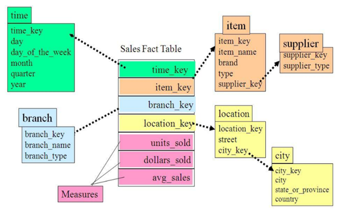

# 二、数仓理论

## 建模

当今的数据处理大致可以分成两大类：联机事务处理**OLTP**（on-line transaction processing）、联机分析处理**OLAP**（On-Line Analytical Processing）。OLTP是传统的关系型数据库的主要应用，主要是基本的、日常的事务处理，例如银行交易。OLAP是数据仓库系统的主要应用，支持复杂的分析操作，侧重决策支持，并且提供直观易懂的查询结果。二者的主要区别对比如下表所示。

| **对比属性** | **OLTP**                   | **OLAP**                   |
| ------------ | -------------------------- | -------------------------- |
| **读特性**   | 每次查询只返回少量记录     | 对大量记录进行汇总         |
| **写特性**   | 随机、低延时写入用户的输入 | 批量导入                   |
| **使用场景** | 用户，Java EE项目          | 内部分析师，为决策提供支持 |
| **数据表征** | 最新数据状态               | 随时间变化的历史状态       |
| **数据规模** | GB                         | TB到PB                     |

### 关系建模

关系模型如下图所示，严格遵循第三范式（3NF），从图中可以看出，较为松散、零碎，物理表数量多，而数据冗余程度低。由于数据分布于众多的表中，这些数据可以更为灵活地被应用，功能性较强。关系模型主要应用与OLTP系统中，为了保证数据的一致性以及避免冗余，所以大部分业务系统的表都是遵循第三范式的。

**三大范式（3NF）**
1、第一范式（1NF）：数据表中的每一列（每个字段）必须是不可拆分的最小单元，也就是确保每一列的原子性；

2、第二范式（2NF）：满足1NF后，一是表必须有一个主键；二是没有包含在主键中的列必须完全依赖于主键，而不能只依赖于主键的一部分；

3、第三范式（3NF）：必须先满足第二范式（2NF），要求：表中的每一列只与主键直接相关而不是间接相关（表中的每一列只能依赖于主键）；

### 维度建模

维度模型如下图所示，主要应用于OLAP系统中，通常以某一个事实表为中心进行表的组织，主要面向业务，特征是可能存在数据的冗余，但是能方便的得到数据。关系模型虽然冗余少，但是在大规模数据，跨表分析统计查询过程中，会造成多表关联，这会大大降低执行效率。所以通常我们采用维度模型建模，把相关各种表整理成两种：事实表和维度表两种。

### 维度建模分类

在维度建模的基础上又分为三种模型：星型模型、雪花模型、星座模型。

**星型模型**

雪花模型与星型模型的区别主要在于维度的层级，标准的星型模型维度只有一层，而雪花模型可能会涉及多级。

**雪花模型**

雪花模型，比较靠近3NF，但是无法完全遵守，因为遵循3NF的性能成本太高。

**星座模型**

星座模型与前两种情况的区别是事实表的数量，星座模型是基于多个事实表。基本上是很多数据仓库的常态，因为很多数据仓库都是多个事实表的。所以星座不星座只反映是否有多个事实表，他们之间是否共享一些维度表。所以星座模型并不和前两个模型冲突。

### 模型选择

首先就是星座不星座这个只跟数据和需求有关系，跟设计没关系，不用选择。星型还是雪花，取决于性能优先，还是灵活更优先。目前实际企业开发中，不会绝对选择一种，根据情况灵活组合，甚至并存(一层维度和多层维度都保存)。但是整体来看，更倾向于维度更少的星型模型。尤其是Hadoop体系， 减少Join就是减少Shuffle， 性能差距很大。(关系型数据可以依靠强大的主键索引)。

## 维度表和事实表

### 维度表

维度表：一般是对事实的描述信息。每一张维表对应现实世界中的一个对象或者概念。  例如：用户、商品、日期、地区等。

**特征**：

维表的范围很宽（具有多个属性、列比较多）

跟事实表相比，行数相对较小：通常< 10万条

内容相对固定：编码表

时间维度表：

| 日期ID     | day of week | day of year | 季度 | 节假日 |
| ---------- | ----------- | ----------- | ---- | ------ |
| 2020-01-01 | 2           | 1           | 1    | 元旦   |
| 2020-01-02 | 3           | 2           | 1    | 无     |
| 2020-01-03 | 4           | 3           | 1    | 无     |
| 2020-01-04 | 5           | 4           | 1    | 无     |
| 2020-01-05 | 6           | 5           | 1    | 无     |

### 事实表

事实表中的每行数据代表一个业务事件（下单、支付、退款、评价等）。“事实”这个术语表示的是业务事件的度量值（可统计次数、个数、金额等），例如，订单事件中的下单金额。

每一个事实表的行包括：具有可加性的数值型的度量值、与维表相连接的外键、通常具有两个和两个以上的外键、外键之间表示维表之间多对多的关系。

**特征**：

行数非常的大

内容相对的窄：列数较少

经常发生变化，每天会新增加很多。

**1）事务型事实表**

以每个事务或事件为单位，例如一个销售订单记录，一笔支付记录等，作为事实表里的一行数据。一旦事务被提交，事实表数据被插入，数据就不再进行更改，其更新方式为增量更新。 

**2）周期型快照事实表**

周期型快照事实表中不会保留所有数据，只保留固定时间间隔的数据，例如每天或者每月的销售额，或每月的账户余额等。

**3）累积型快照事实表**

累计快照事实表用于跟踪业务事实的变化。例如，数据仓库中可能需要累积或者存储订单从下订单开始，到订单商品被打包、运输、和签收的各个业务阶段的时间点数据来跟踪订单声明周期的进展情况。当这个业务过程进行时，事实表的记录也要不断更新。

| 订单id | **用户id** | **下单时间** | **打包时间** | **发货时间** | **签收时间** | **订单金额** |
| ------ | ---------- | ------------ | ------------ | ------------ | ------------ | ------------ |
|        |            | 3-8          | 3-8          | 3-9          | 3-10         |              |

### 总结

事实表： 记录某个发生的事实。一般在记录事实时会参考3W原则，对事实进行描述。记录who，where，when。

维度表： 用来描述事实，或描述事实中的某一部分！

事务型事实表：  特点是一旦事实发生，不会改变！表中的记录，一般只会新增！

周期型事实表： 记录事实，只记录这个事实在某个时间周期内最终的状态！重视结果！

累积型快照事实表： 记录事实，记录整个事实在某个时间周期内的累积的变化状态！重视过程！

## 数仓分层

**分层**

**原始数据层ODS(Operation Data Store)**：存放原始数据，直接加载原始日志、数据数据保持原貌不做处理。

**服务数据层DWD(data warehouse detail)**：对ODS层数据进行清洗(去除空值，脏数据，超过极限范围的数据)、维度退化、脱敏等

**明细数据层DWS(data warehouse service)**：以DWD为基础，按天进行轻度汇总。

**数据主题层DWT(data warehouse Topic)**：以DWS为基础，按主题进行汇总。

**数据应用层ADS(Application Data Store)**：为各种统计报表提供数据。

**分层目的**

1)**把复杂问题简单化**，将复杂的任务分解成多层来完成，每一层只处理简单的任务，方便定位问题；

2)**减少重复开发**，规范数据分层通过的中间层数据，能够减少极大的重复计算，增加一次计算结果的复用件；

3)**隔离原始数据**，不论是数据的异常还是数据的敏感性，使真实数据与统计数据解耦；

### 命名规范

1.**数仓表**

ODS层命名为ods_表名

DWD层命名为dwd_dim/fact_表名

DWS层命名为dws_表名

DWT层命名为dwt_购物车

ADS层命名为ads_表名

临时表命名为xxx_tmp

用户行为表，以log为后缀。

**2.数仓脚本**

数据源_to_目标_db/log.sh

用户行为脚本以log为后缀；业务数据脚本以db为后缀。

### 总结

ODS层：  原始数据层，将采集的数据原封不动导入。分区表，按照日期进行分区。

DWD层：数据明细层，将ODS层的数据，进行ETL后，展开明细。分区表，按照日期进行分区。

DWS层： 数据服务层，将DWD层数据，每天轻度聚合！每天一个分区，分区表，按照日期进行分区。

DWT层： 数据主题层，围绕某个具体要统计的主题，例如日活，订单，用户等，一张总表，记录了从第一天截至今日的所有的围绕此主题的汇总数据。非分区表，一张普通表。

ADS层： 数据应用层。可以从DWS层或DWT层取需要的数据。非分区表，一张普通表。

## 数仓建模

### ODS层

（1）保持数据原貌不做任何修改，作用：备份数据。

（2）数据采用压缩，减少磁盘存储空间（例如：原始数据100G，可压缩到10G左右）。

（3）创建分区表，防止后续的全表扫描。

### DWD层

DWD层需构建维度模型，一般采用星型模型，呈现状态为星座模型。

维度建模一般按照以下四个步骤：选择业务过程→声明粒度→确认维度→确认事实

（1）**选择业务过程**

在业务系统中挑选一个业务线，如下单业务，支付业务，退款业务，物流业务，一条业务线对应一张事实表。

（2）**声明粒度**

数据粒度指数据仓库的数据中保存数据的细化程度或综合程度的级别。声明粒度意味着精确定义事实表中的一行数据表示什么，应该尽可能选择最小粒度，以此来应各种各样的需求。

典型的粒度声明如下：

订单中，每个商品项作为下单事实表中的一行，粒度为每次下单

每周的订单次数作为一行，粒度就是每周下单。

每月的订单次数作为一行，粒度就是每月下单

（3）**确定维度**

维度的主要作用是描述业务，主要表示的是“who，where，when”等3w信息。

（4）**确认事实**

此处的“事实”一词，指业务中的**度量值**，如订单金额、下单次数等。

在DWD层，以业务过程为建模驱动，基于每个具体业务过程的特点，构建**最细粒度**的明细层事实表。事实表可做适当的宽表化处理。

举例：选择业务(支付)=》声明粒度（每天、每100条，按时间数量等）=》确认维度（表）时间、地区、商品、优惠券、活动等维度表=》确认事实：如日活率、每日优惠券使用率、每日某商品购买率等。

|                | **时间** | **用户** | **地区** | **商品** | **优惠券** | **活动** | **编码** | **度量值** |
| -------------- | -------- | -------- | -------- | -------- | ---------- | -------- | -------- | ---------- |
| **订单**       | √        | √        | √        |          |            | √        |          | 件数/金额  |
| **订单详情**   | √        |          | √        | √        |            |          |          | 件数/金额  |
| **支付**       | √        |          | √        |          |            |          |          | 金额       |
| **加购**       | √        | √        |          | √        |            |          |          | 件数/金额  |
| **收藏**       | √        | √        |          | √        |            |          |          | 个数       |
| **评价**       | √        | √        |          | √        |            |          |          | 个数       |
| **退款**       | √        | √        |          | √        |            |          |          | 件数/金额  |
| **优惠券领用** | √        | √        |          |          | √          |          |          | 个数       |

至此，数仓的维度建模已经完毕，DWS、DWT和ADS和维度建模已经没有关系了。DWS和DWT都是建宽表，宽表都是按照主题去建。主题相当于观察问题的角度。对应着维度表。

### DWS层

统计各个主题对象的当天行为，服务于DWT层的主题宽表，以及一些业务明细数据，应对特殊需求（例如，购买行为，统计商品复购率）。

### DWT层

以分析的**主题对象**为建模驱动，基于上层的应用和产品的指标需求，构建主题对象的全量宽表。

### ADS层

对电商系统各大主题指标分别进行分析。

### 总结

ODS层： 特点是保持原始数据的原貌，不作修改！原始数据怎么建模，ODS就怎么建模。（保持原样、压缩、分区）

举例： 用户行为数据特征是一条记录就是一行，ODS层表(line string)；业务数据，参考Sqoop导入的数据类型进行建模。

DWD层：特点从ODS层，将数据进行ETL（清洗），轻度聚合，再展开明细。

①在展开明细时，对部分维度表进行降维操作。如：将商品一二三级分类表，sku商品表，spu商品表，商品品牌表合并汇总为一张维度表！

​				例如：将商品一二三级分类表，sku商品表，spu商品表，商品品牌表合并汇总为一张维度表！

②对事实表，参考星型模型的建模策略，按照**选择业务过程→声明粒度→确认维度→确认事实**思路进行建模

选择业务过程： 选择感兴趣的事实表。
声明粒度： 选择最细的粒度！可以由最细的粒度通过聚合的方式得到粗粒度。
选择维度： 根据3w原则确认维度，挑选自己感兴趣的维度。
确认事实： 挑选感兴趣的度量字段，一般是从事实表中选取。

DWS层： 根据业务需求进行分主题建模！一般是建宽表！

DWT层：  根据业务需求进行分主题建模！一般是建宽表！

ADS层：  根据业务需求进行建模！	

## 其它	 

### 数仓架构

| 名称       | 说明                       |
| ---------- | -------------------------- |
| 业务数仓   | 24张表                     |
| 数仓分层   | 5层，多了DWT(主题明细层)层 |
| 建模方式   | 更规范                     |
| 数据可视化 | superset                   |
| 集群监控   | zabbix                     |
| 元数据     | atlas                      |
| 权限管理   | ranger                     |

### 关键表

注意：特殊就是全量导一次。

| 表名                             | 备注                                                   | 同步方式   | 字段名       | 字段描述                           |
| -------------------------------- | ------------------------------------------------------ | ---------- | ------------ | ---------------------------------- |
| order_info(订单表)               |                                                        | 新增和变化 | order_status | 订单状态(会被修改)                 |
|                                  |                                                        |            | create_time  | 创建时间                           |
|                                  |                                                        |            | operate_time | 操作时间(最后一次修改订单的时间)   |
| order_detail(订单详情表)         | 一张订单表对多张订单详情表                             | 增量       | create_time  | 创建时间                           |
|                                  |                                                        |            | order_id     | 订单号可以和order_info.id关联      |
| sku_info(sku商品表)              | 一个spu对应多个sku                                     | 全量       | create_time  | 创建时间                           |
| user_info(用户表)                |                                                        | 新增和变化 | create_time  | 创建时间                           |
|                                  |                                                        |            | operate_time | 操作时间(最后一次用户信息的时间)   |
| payment_info(支付流水表)         |                                                        | 增量       | payment_time | 支付时间                           |
| base_category1(商品一级分类表)   |                                                        | 全量       |              |                                    |
| base_category2(商品二级分类表)   |                                                        | 全量       |              |                                    |
| base_category3(商品三级分类表)   |                                                        | 全量       |              |                                    |
| base_province（省份表）          |                                                        | 全量导一次 |              |                                    |
| base_region(地区表)              |                                                        | 全量导一次 |              |                                    |
| base_trademark（品牌表）         |                                                        | 全量       |              |                                    |
| order_status_log(订单状态表)     | 针对每一个订单id的订单状态每发生一次改变都会记录在此。 | 增量       | operate_time | 操作时间                           |
| spu_info(SPU商品表)              | 一个spu对应多个sku，有三级分类Id                       | 全量       |              |                                    |
| comment_info(商品评论表)         | 有spu_id、sku_id                                       | 增量       | create_time  | 创建时间                           |
| order_refund_info（退单表）      | 某笔订单发生退货                                       | 增量       | create_time  | 创建时间                           |
| cart_info(加购表)                | 加入购物车时记录信息                                   | (特殊)全量 | create_time  | 创建时间                           |
|                                  |                                                        |            | operate_time | 操作时间(最后一次修改购物车的时间) |
| favor_info（商品收藏表）         | 记录spu_id                                             | (特殊)全量 | create_time  | 创建时间                           |
|                                  |                                                        |            | cancel_time  | 取消收藏的最后一次时间             |
| coupon_use（优惠券领用表）       | 记录购物券id：coupon_info.id、订单id、用户id。         | 增量和变化 | get_time     | 领券时间                           |
|                                  |                                                        |            | using_time   | 使用时间                           |
|                                  |                                                        |            | used_time    | 支付时间                           |
| coupon_info（优惠券表）          |                                                        | 全量       | create_time  | 创建时间                           |
| activity_info（活动表）          | 活动开始/结束/创建时间                                 | 全量       | create_time  | 创建时间                           |
| activity_order（活动订单关联表） | 某订单id参与了此次活动                                 | 增量       | create_time  | 创建日期                           |
| activity_rule（优惠规则表）      | 满减金额/件数、优惠金额/折扣                           | 全量       |              |                                    |
| base_dic（编码字典表）           |                                                        | 全量       | create_time  | 创建日期                           |
|                                  |                                                        |            | operate_time | 操作时间(最后一次修改的时间)       |
| date_info（时间表）              |                                                        | 全量导一次 |              |                                    |
| holiday_info（假期表）           |                                                        | 全量导一次 |              |                                    |
| holiday_year（假期年表）         | 假期开始/结束/创建时间                                 | 全量导一次 |              |                                    |

### 业务表同步方式

**同步周期**

每天同步一次！每天将同步的数据在hive中创建一个分区。一般是次日凌晨0:30(保证用户行为数据已经采集到hdfs)开始同步前一天的数据！

**同步策略**

原则： 数据的同步策略只取决于数据量！

​			数据量小或修改频率低的表一般可以进行全量同步(省事)！

​			数据量大或修改频率高的表一般使用增量同步！

增量同步： select * from 表名 where create_time='同步的数据日期'

全量同步： select * from 表名

新增和变化同步：  select * from 表名 where create_time='同步的数据日期' or operate_time='同步的数据日期'

**数据保存周期**

数仓中的数据需要保留半年的回溯周期！

