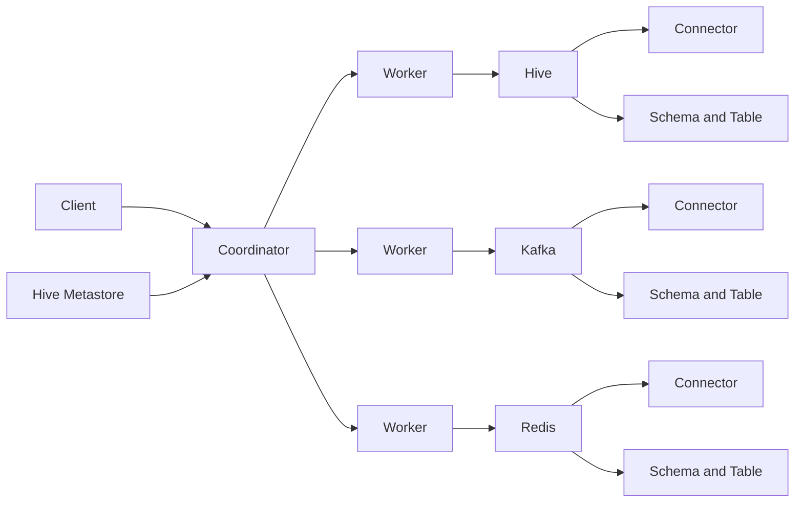

# presto

集群规划：版本 0.189

| 服务名称 | 子服务      | hadoop102 | hadoop103 | hadoop104 |
| -------- | ----------- | --------- | --------- | --------- |
| Presto   | Coordinator | √         |           |           |
|          | Worker      |           | √         | √         |

注意：命令行Client和可视化Client安装在Coordinator子服务所在节点。

官网：https://prestodb.io/

Presto是一个开源的分布式SQL查询引擎，适用于交互式分析查询，数据量支持GB到PB字节。

Presto的设计和编写完全是为了解决像Facebook这样规模的商业数据仓库的交互式分析和处理速度的问题。

架构：Presto由一个Coordinator和多个Worker组成。

1)由客户端提交查询，从Presto命令行CLI提交到Coordinator。

2) Coordinator解析查询计划，然后把任务分发给CatalogWorker执行。

3) Worker负责执行任务和处理数据。

4) Catalog表示数据源。一个Catalog包含Schema和Connector。

5) Connector是适配器，用于Presto和数据源(如Hive、Redis) 的连接， 类似于JDBC。

6) Schema类似于Mysql中数据库， Table类似于MySQL中表。

7) Coordinator是负责从Worker获取结果并返回最终结果给Client。



**优点**：Presto基于内存运算， 减少了硬盘IO， 计算更快；能够连接多个数据源，跨数据源连表查，如从Hive查询大量网站访问记录， 然后从Mysql中匹配出设备信息。

**缺点**：Presto能够处理PB级别的海量数据分析， 但Presto并不是把PB级数据都放在内存中计算的。而是根据场景， 如Count、AVG等聚合运算， 是边读数据边计算， 再清内存， 再读数据再计算，这种耗的内存并不高。但是连表查，就可能产生大量的临时数据，因此速度会变慢。

**Presto、Impala性能比较**：可看https://blog.csdn.net/u012551524/article/details/79124532，测试结论：Impala性能稍领先于Presto，但是Presto在数据源支持上非常丰富，包括Hive、图数据库、传统关系型数据库、Redis等。

## 安装

```
cd /opt/software
# presto server
wget https://repo1.maven.org/maven2/com/facebook/presto/presto-server/0.238.2/presto-server-0.238.2.tar.gz
# presto command client
wget https://repo1.maven.org/maven2/com/facebook/presto/presto-cli/0.238.2/presto-cli-0.238.2-executable.jar
# presto jdbc jar
wget https://repo1.maven.org/maven2/com/facebook/presto/presto-jdbc/0.238.2/presto-jdbc-0.238.2.jar
cp /opt/software/presto-jdbc-0.238.2.jar $JAVA_HOME/lib
xsync $JAVA_HOME/lib
tar -zxvf presto-server-0.238.2.tar.gz -C /opt/module/
mv /opt/module/presto-server-0.238.2/ /opt/module/presto
vim /etc/profile
#PRESTO_HOME
export PRESTO_HOME=/opt/module/presto
export PATH=$PATH:$PRESTO_HOME/bin

xsync /etc/profile
source /etc/profile
mkdir /opt/module/presto/data
mkdir /opt/module/presto/etc
vim /opt/module/presto/etc/jvm.config
-server
-Xmx16G
-XX:+UseG1GC
-XX:G1HeapRegionSize=32M
-XX:+UseGCOverheadLimit
-XX:+ExplicitGCInvokesConcurrent
-XX:+HeapDumpOnOutOfMemoryError
-XX:+ExitOnOutOfMemoryError

# 命令行Client安装
mv /opt/software/presto-cli-0.238.2-executable.jar /opt/software/prestocli
sudo chmod +x /opt/software/prestocli
mv /opt/software/prestocli /opt/module/presto/bin

# Presto支持多个数据源，在Presto里面叫catalog，这里配置支持Hive的数据源，配置一个Hive的catalog
mkdir /opt/module/presto/catalog
vim /opt/module/presto/etc/catalog/hive.properties # hive catalog
connector.name=hive-hadoop2
hive.metastore.uri=thrift://hadoop102:9083

vim /opt/module/presto/etc/catalog/mysql.properties # mysql catalog
connector.name=mysql
connection-url=jdbc:mysql://hadoop102:3306
connection-user=root
connection-password=1234

vim /opt/module/presto/etc/node.properties
node.environment=production
node.id=ffffffff-ffff-ffff-ffff-ffffffffffff
node.data-dir=/opt/module/presto/data

xsync $PRESTO_HOME
# 分发之后，修改配置下几台机器的node属性，node id每个节点都不一样。
xcall cat /opt/module/presto/etc/node.properties | grep 'node.id'
node.id=ffffffff-ffff-ffff-ffff-ffffffffffff
node.id=ffffffff-ffff-ffff-ffff-fffffffffffe
node.id=ffffffff-ffff-ffff-ffff-fffffffffffd

vim /opt/module/presto/etc/config.properties # hadoop102配置coordinator节点
coordinator=true
node-scheduler.include-coordinator=false
http-server.http.port=8881
query.max-memory=50GB
discovery-server.enabled=true
discovery.uri=http://hadoop102:8881

vim /opt/module/presto/etc/config.properties # hadoop103、hadoop104上配置worker节点
coordinator=false
http-server.http.port=8881
query.max-memory=50GB
discovery.uri=http://hadoop102:8881

hive --service metastore # 启动hive
xcall $PRESTO_HOME/bin/launcher start # 前台启动Presto：launcher run，控制台显示日志；后台启动Presto：launcher start，日志查看路径/opt/module/presto/data/var/log，三台一起启动。
jpsall|grep 'Pre'
115822 PrestoServer
61486 PrestoServer
64524 PrestoServer

xcall $PRESTO_HOME/bin/launcher stop # 关闭
prestocli --server hadoop102:8881 --catalog mysql --schema sys # 启动prestocli，出现类似presto:*
presto:sys> show tables;
prestocli --server hadoop102:8881 --catalog hive --schema default
presto:default> show tables;
```

可视化安装

```
# 可视化安装
# 必须安装好git java nodejs
wget https://nodejs.org/dist/v12.18.3/node-v12.18.3-linux-x64.tar.xz
//解压
xz -d node-v12.18.3-linux-x64.tar.xz
tar -xvf node-v12.18.3-linux-x64.tar
mv node-v12.18.3-linux-x64 node
mv node /opt/module/
vim /etc/profile
#NODE_HOME
export NODE_HOME=/opt/module/node
export PATH=$PATH:$NODE_HOME/bin

source /etc/profile
git clone https://github.com/yanagishima/yanagishima.git
cd yanagishima
git checkout -b 18.0 refs/tags/18.0
./gradlew distZip
cd build/distributions
unzip yanagishima-[version].zip
cd yanagishima-[version]
vim conf/yanagishima.properties
nohup bin/yanagishima-start.sh >y.log 2>&1 &

vim /etc/profile
#PRESTOWEB_HOME
export PRESTOWEB_HOME=/opt/module/node
export PATH=$PATH:$PRESTOWEB_HOME/bin

source /etc/profile
```

